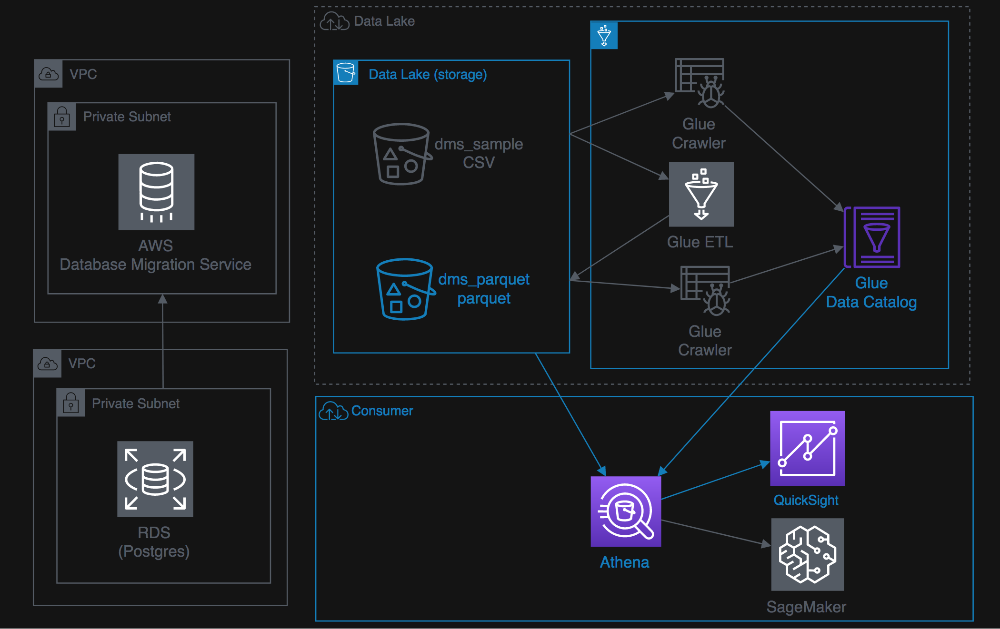

+++
title = "00 Introduction"
weight = 100
+++

#### What you'll do with Labs:

These labs are designed to be completed in sequence, and the full set of instructions are documented below. Read and follow along to complete the labs. Our lab instructor will give you a high-level overview of the labs and help answer any questions. Don't worry if you get stuck, we provide hints along the way.

**Architecture Patterns**

#### Intially you with perform Data Ingestion

#### Then Data Transformations

#### Then Explore this DataLake using SQL and Visulization tool

#### Finally apply Machine Learning

{}

**Before you start with the hands-on tasks of this workshop, please check if you are able to access AWS Console with complete access, please use following pages:**

{}

{}

