+++
title = "AI ML Amazon SageMaker"
weight = 1010
+++

### Steps	
- Create Amazon SageMaker Notebook Instance	
- Connect the SageMaker Jupyter notebook to Athena	
- Working in Pandas	
 
### Create Amazon SageMaker Notebook Instance 

1.	Go to the Amazon Sagemaker from AWS console
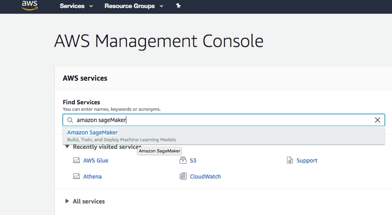
 

2.	In the Amazon SageMaker navigation pane, click Notebook instances and Click Create notebook instance. 
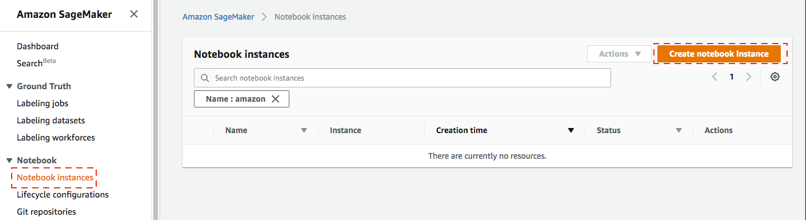
 

3.	Put following values to create instance 
a.	Give your choice of name for Notebook instance name e.g. “datalake-Sagemaker”
b.	You can leave Notebook instance type as default value “ml.t2.medium” for this lab.
c.	Leave Elastic Inference as null. This is to add extra resources.
d.	Choose a role for the notebook instances in Amazon SageMaker to interact with Amazon S3. As role doesn’t exist select the Create new role option.
e.	In Create an IAM Role pop up window, choose the specific S3 bucket you will grant access to. For this lab, choose Any S3 bucket as shown below and click Create Role:
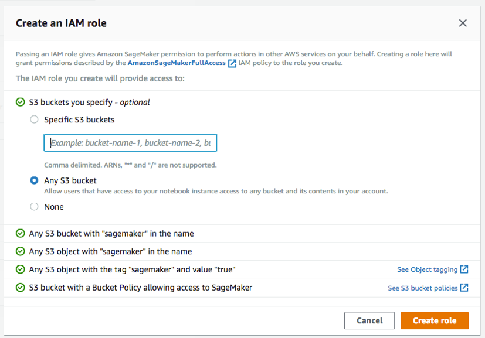
 
f.	You will see a Role got create , As you are going to Access Athena from SageMaker, so SageMaker execution role must have the necessary permission to access Athena. To achieve that click the link for newly created IAM Role and in the new window
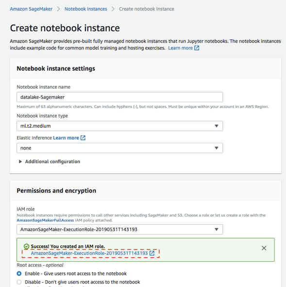
 

g.	There is no Athena permission available in your SageMaker execution role. In this case, it is “AmazonSageMaker-ExecutionRole-20190531T143193”. Click Attach Policies button in Permissions tab.
 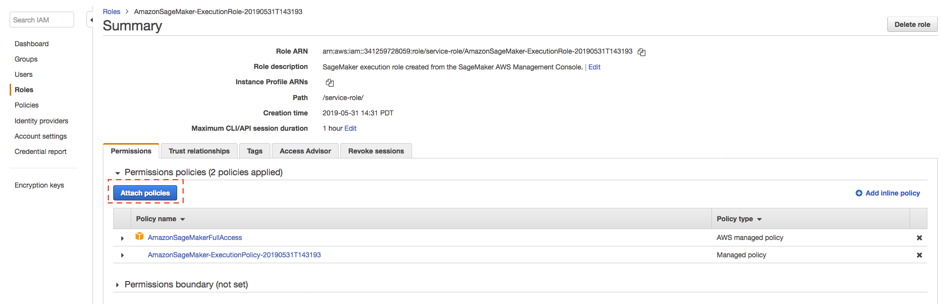

h.	Filter policies by “Athena”, check AmazonAthenaFullAccess managed policy and click Attach Policy button at the bottom of the screen. Close the new window/tab.
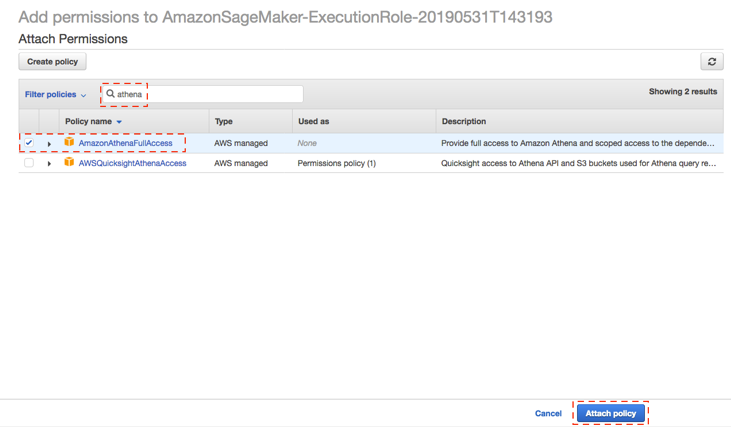
 

After Athena policy to IAM Role , you can close this window and go back  
SageMaker browser window.
i.	Leave all other options default. Click Create notebook instance. 
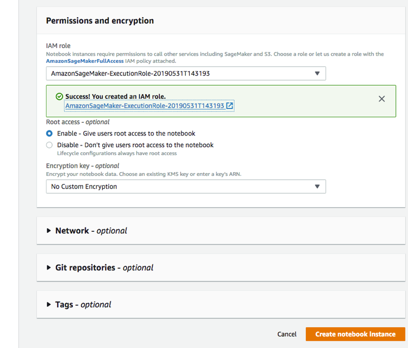
 

4.	Wait for the notebook instances to be created and the Status to change to Inservice and Click Open Jupyter  in from Actions column.
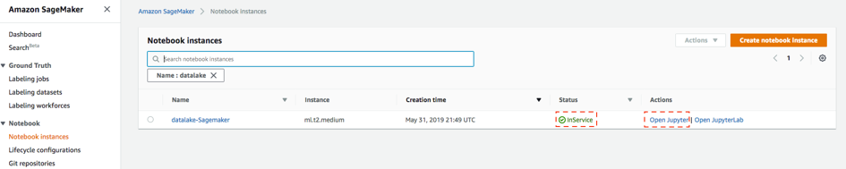 

5.	The notebook interface opens in a separate browser window.
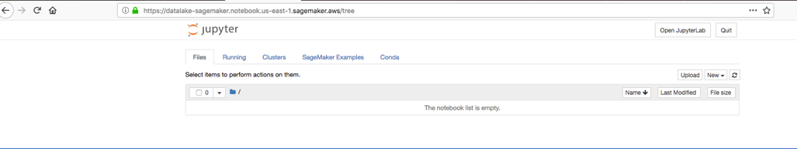
 
### Connect the SageMaker Jupyter notebook to Athena
1.	In the Jupyter notebook interface, click New. For the kernel, choose conda_python3.
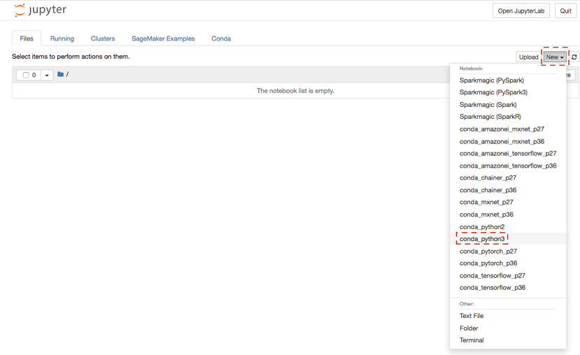 

**Note**: Amazon SageMaker provides several kernels for Jupyter, including support for Python 2 and Python 3, MXNet, TensorFlow, and PySpark. This exercise uses Python because it includes the Pandas library. 

2.	Within the notebook, execute the following commands to install the Athena JDBC driver and In the top toolbar, click Run. (PyAthena is a Python DB API 2.0 (PEP 249) compliant client for the Amazon Athena JDBC driver.)

Enter -> import sys
Enter -> !{sys.executable} -m pip install PyAthena

 

Observe success message in log:
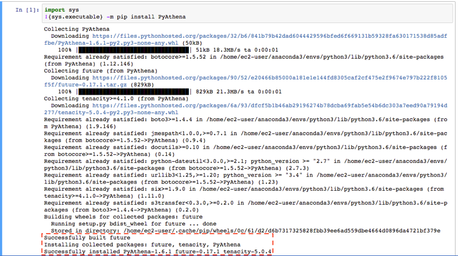
 

Note: If an error occurs, you may be required to set a file system path for an application that helps build the driver software. If this is the case, follow these steps.
- a.	In your home notebook window, select New > Terminal.
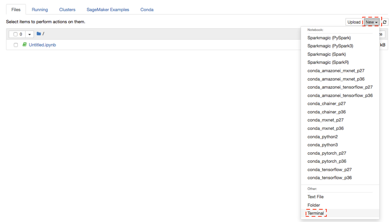 
- b.	Copy following command and press Enter.
**sudo ln -s  /usr/libexec/gcc/x86_64-amazon-linux/4.8.5/cc1plus /usr/local/bin/**
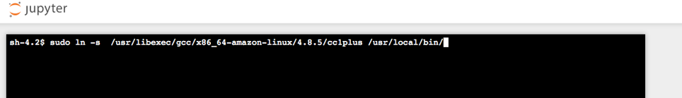
 
c.	Run the original paragraph code from Step 2 again to build the AthenaJDBC driver .

### Working in Pandas
After the Athena driver is installed, you can use the JDBC connection to connect to Athena and populate the Pandas data frames. For data scientists, working with data is typically divided into multiple stages: ingesting and cleaning data, analyzing and modeling data, then organizing the results of the analysis into a form suitable for plotting or tabular display. Pandas is the ideal tool for all of these tasks.

1.	You can load Athena table data from Data lake to Pandas data frame and apply machine learning. Copy following code in your notebook and replace following:
a.	Account number : Open this link https://console.aws.amazon.com/billing/home?#/account and copy account ID.
b.	Your region : Throughout this lab you are working in N. Virginia region which us-east-1. Refer link here to get region name mapping - https://docs.aws.amazon.com/general/latest/gr/rande.html 
c.	Your Athena Database name, this is the Glue Database name which you created during previous lab e.g. “ticketdata”

```
from pyathena import connect
import pandas as pd
conn = connect(s3_staging_dir='s3://aws-athena-query-results-<youraccountnumber>-<yourregion>/',
               region_name='<yourregion>')

df = pd.read_sql('SELECT * FROM "<yourathenadatabase>"."nfl_stadium_data"  order by stadium limit 10;', conn)
df
```

2.	 Click Run and data frame will display query output.
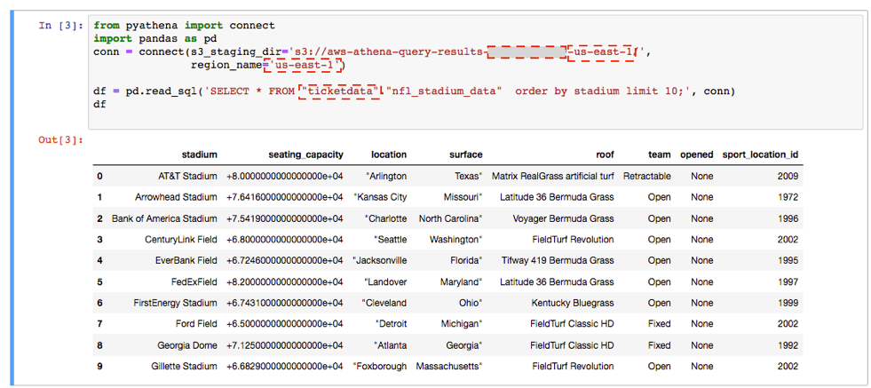

In this query , you are loading all nfl statdium information to panda dataframe from table nfl_stadium_data.

Note:
if you get a SageMaker does not have Athena execution permissions error issue.  You need to add Athena Access to the Sagemaker role as steps provide in previous section.

3.	You can use apply different ML algorithm in populated Pandas data frames. For example, draw a plot. Copy following code in your notebook and replace Your Athena Database name, this is the Glue Database name which you created during previous lab e.g. “ticketdata”.
In this query , you are loading all even ticket information to panda dataframe from table sporting_event_ticket_info.
```
df = pd.read_sql('SELECT sport,                  \
                 event_date_time,                \
                 home_team,away_team,            \
                     city,                       \
                     count(*) as tickets,        \
                     sum(ticket_price) as total_tickets_amt,           \
                     avg(ticket_price) as avg_ticket_price,            \
                     max(ticket_price) as max_ticket_price,            \
                     min(ticket_price) as min_ticket_price             \
                 FROM "<yourathenadatabase>"."sporting_event_ticket_info" \
                 group by 1,2,3,4,5                                    \
                 order by 1,2,3,4,5          limit 1000;', conn)
df
```
4.	Click Run and data frame will display query output 
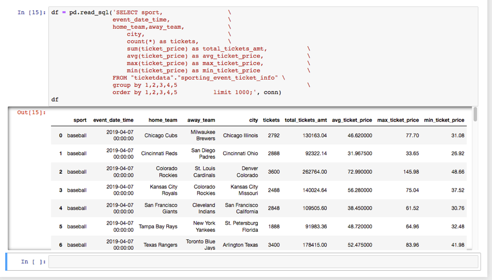 

5.	In new execution line copy following code 
```
import matplotlib.pyplot as plt
df.plot(x='event_date_time',y='avg_ticket_price')
```
6.	Click Run and you will see data plot which got draw using matplotlib library.
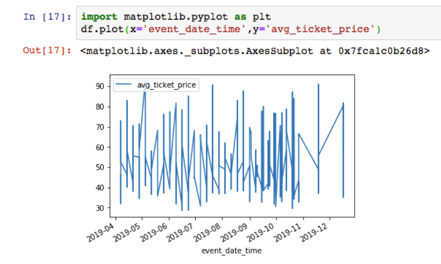 