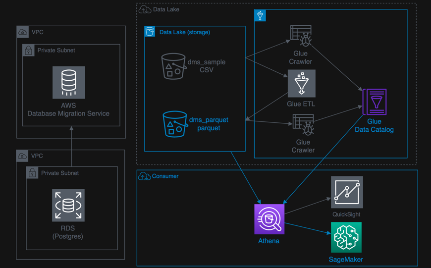

+++
title = "10 Lab: AI ML using Sagemaker"
weight = 1000
+++

### Indroduction

Amazon SageMaker is an end-to-end machine learning platform that lets you build, train, and deploy machine learning models in AWS. It is a highly modular service that lets you use each of these components independently of each other. 

You will Learn:
•	How to use the Jupyter notebook component of Sagemaker to integrate with the data lake using Athena 
•	Populate data frames for data manipulation. 
 

This process to prepare the data to satisfy the needs of ML algorithms is iterative. To prepare the data, we will make the table definitions in Athena available in a Jupyter notebook instance of SageMaker. 
Jupyter notebooks are popular among data scientists and used to visualize data, perform statistical analysis, complete data manipulations, and make the data ready for machine learning work.

Below is a list of the steps for this lab:

{}