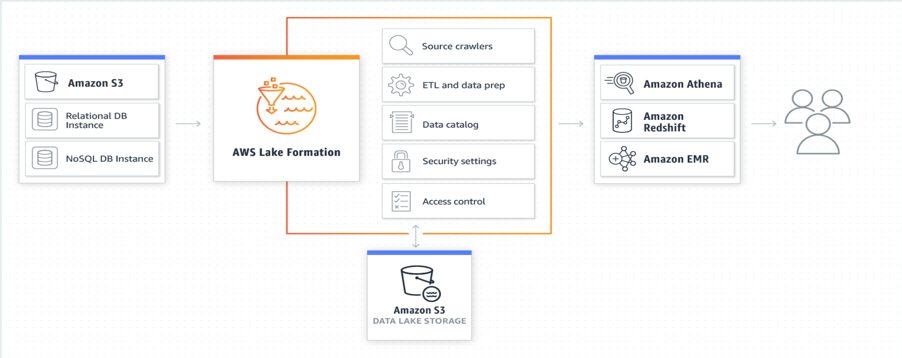

+++
title = "12 Lab: Data Lake Automation"
weight = 1200
+++

### Introduction

This lab will give you an understanding of the AWS Lake Formation – a service that makes it easy to set up a secure data lake in days, as well as Athena for querying the data you import into your data lake.

 
#### Prerequisites:

The DMS Lab is a prerequisite for this lab.

#### Tasks Completed in this Lab:

In this lab you will be completing the following tasks:

1.	Create a JDBC connection to RDS in AWS Glue
2.	Lake Formation IAM Role
NOTE: If your account is already setup with Glue Data catalog permissions then upgrade to Lake Formation Permission set by following -Link
3.	Lake Formation – Add Administrator and start workflows using Blueprints 
4.	Explore the components of a Glue WorkFlow created by lake formation
5.	Explore workflow results in Athena
6.	Grant fine grain access controls to Data Lake user
7.	Verify data permissions using Athena
