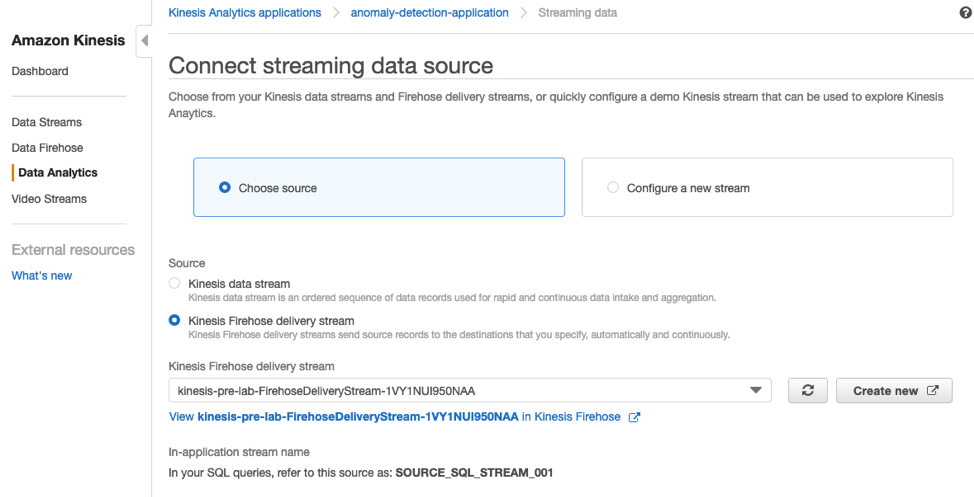

+++
title = "Kinesis Main Lab"
weight = 320
+++

### Steps:
- Introduction
- Set up an Analytics Pipeline Application
- Connect Lambda as destination to Analytics Pipeline
- Environment Cleanup
- Appendix: Anomaly Detection Scripts

## Introduction

This guide helps you complete Real-Time Clickstream Anomaly Detection using Amazon Kinesis Data Analytics.

Analyzing web log traffic to gain insights that drive business decisions has historically been performed using batch processing.  Although effective, this approach results in delayed responses to emerging trends and user activities.  There are solutions that process data in real time using streaming and micro-batching technologies, but they can be complex to set up and maintain.  Amazon Kinesis Data Analytics is a managed service that makes it easy to identify and respond to changes in data behavior in real-time.

In the prelab, you set up the prerequisites required to complete this lab. Now, you will work to implement the following data pipeline .


### Set up an Analytics Pipeline Application

**Make sure you are in US-EAST-1 (N. Virginia) region**

1.	Navigate to the Amazon Kinesis console.
2.	Click Get started and then click Create analytics application.

3.	On the Create application page, fill the fields as follows:
  - a.	For Application name, type anomaly-detection-application.
  - b.	For Description, type a description for your application.
  - c.	Leave “SQL” selected as Default.

4.	Click Create application 

5.	On the application page, click Connect streaming dat- a.

6.	Select Choose source, and make the following selections:
- a.	For Source, choose Kinesis Firehose delivery stream.
b.	For Kinesis Firehose delivery stream, type <stack name>-FirehoseDeliveryStream-<random string>

7.	In the Record pre-processing with AWS Lambda section, choose Disabled.
8.	In the Access to chosen resources section, select Choose from IAM roles that Kinesis Analytics can assume.
9.	In the IAM role box, search for the following role: 
<stack name>-CSEKinesisAnalyticsRole-<random string>


`Do not click “Discover schema” yet.`

You have set up the Kinesis Data Analytics application to receive data from a Kinesis Data Firehose and to use an IAM role from the pre-lab. However, you need to start sending some data to the Kinesis Data Firehose before you click Discover schema in your application. 

Navigate to the Amazon Kinesis Data Generator (Amazon KDG) which you setup in prelab and start sending the Schema Discovery Payload at 1 record per second by click on Send data button. Make sure to select the region “us-east-1” 

Now that your Kinesis Data Firehose is receiving data, you can continue configuring the Kinesis Data Analytics Application.

10.	Go back to the AWS console, Now click Discover Schema. (Make sure your KDG is sending data to your Kinesis Data Firehose.)

11.	Click Save and continue. Your Kinesis Data Analytics Application is created with an input stream.


Now, you can add some SQL queries to easily analyze the data that is being fed into the stream. 
12.	In the Real time analytics section, click Go to SQL editor.

13.	Click on “Yes, start application” to start your kinesis analytics application.

14.	Copy the contents of the file named [anomaly_detection.sql](../300/scripts/Kinesis_Anlaytics_anomaly_detection.sql) from your lab package and paste it into the SQL editor. (You can also find code in Appendix)


15.	Click Save and run SQL. The analytics application starts and runs your SQL query. (You can find the SQL query in Appendixa.)

To learn more about the SQL logic, see the Analytics application section in the following blog post:
 https://aws.amazon.com/blogs/big-data/real-time-clickstream-anomaly-detection-with-amazon-kinesis-analytics/

16.	On the Source data tab, observe the input stream data named “SOURCE_SQL_STREAM_001”.

If you click the **Real-time analytics** tab, you will notice multiple in-application streams You will populate data in these streams later in the lab. 


## Connect Lambda as destination to Analytics Pipeline 

Now that the logic to detect anomalies is in the Kinesis Data Firehose, you must. connect it to a destination (AWS Lambda function) to notify you when there is an anomaly. 

1.	Click the Destination tab and click Connect to a Destination. 

2.	For Destination, choose AWS Lambda function. 


3.	In the Deliver records to AWS Lambda section, make the following selections:
  - a.	For Lambda function, choose CSEBeconAnomalyResponse. 
  - b.	For Lambda function version, choose $LATEST.

4.	In the In-application stream section, make the following selections:
- a.	Select Choose an existing in-application stream.
- b.	For In-application stream name, chooseDESTINATION_SQL_STREAM
- c.	For Output format, choose: JSON.

5.	In the Access to chosen resources section, make the following selections: 
- a.	Select Choose from IAM roles that Kinesis Analytics can assume.
- b.	For IAM role, choose pre-lab-CSEKinesisAnalyticsRole-RANDOMSTRING.

Your parameters should look like the following image. This configuration allows your Kinesis Data Analytics Application to invoke your anomaly Lambda function and notify you when any anomalies are detected.


Now that all of the components are in place, you can test your analytics application.
For this part of the lab, you will need to use your Kinesis Data Generator in five separate browser windows. There will be one window sending normal impression payload, one window sending normal click payload, and three windows sending extra click payload. 

1.	Open your KDG in five separate browser windows and sign in as the same user.
Note: Make sure to select the us-east-1 region. Do not accept the default region. 

2.	In one of your browser windows, start sending the Impression payload at a rate of 1 record per second (keep this running).

3.	On another browser window, start sending the Click payload at a rate of 1 record per second (keep this running).

4.	On your last three browser windows, start sending the Click payload at a rate of 1 record per second for a period of 20 seconds. 
**If you did not receive an anomaly email, open another KDG window and send additional concurrent Click payloads. Make sure to not allow these functions to run for more than 10 to 20 seconds at a time. This could cause AWS Lambda to send you multiple emails due to the number of anomalies you are creating.

You can monitor anomalies on the **Real-time analytics tab** in the **DESTINATION_SQL_STREAM** table. If an anomaly is detected, it displays in that table.


Make sure to click other streams and review the data.

Once an anomaly has been detected in your application and you will receive an email and text message to the specified accounts.

Email Snapshot:


SMS Snapshot:

 
After you have completed the lab, click **Actions > Stop Application** to stop your application and avoid flood of SMS and e-mails messages.


### Environment Cleanup 

To save on cost, it is required to dispose your environment which you have created during this lab. Make sure to empty S3 buckets from console before following below steps: 

1.	In your AWS account, navigate to the CloudFormation console. 

2.	On the CloudFormation console, select stack which you have created during pre-lab.


3.	Click on Action drop down and select delete stack as shown in below screenshot.

  

4.	As you created, Kinesis Analytics application manually, so need to delete it by selecting your analytics application . Click on Action drop down and select delete application

 

5.	Go the Cognito and delete the user pool that have been created.

### Appendix: Anomaly Detection Scripts

#### anomaly_detection.sql :

```
CREATE OR REPLACE STREAM "CLICKSTREAM" ( 
   "CLICKCOUNT" DOUBLE
);

CREATE OR REPLACE PUMP "CLICKPUMP" AS 
INSERT INTO "CLICKSTREAM" ("CLICKCOUNT") 
SELECT STREAM COUNT(*) 
FROM "SOURCE_SQL_STREAM_001"
WHERE "browseraction" = 'Click'
GROUP BY FLOOR(
  ("SOURCE_SQL_STREAM_001".ROWTIME - TIMESTAMP '1970-01-01 00:00:00')
    SECOND / 10 TO SECOND
);

CREATE OR REPLACE STREAM "IMPRESSIONSTREAM" ( 
   "IMPRESSIONCOUNT" DOUBLE
);

CREATE OR REPLACE PUMP "IMPRESSIONPUMP" AS 
INSERT INTO "IMPRESSIONSTREAM" ("IMPRESSIONCOUNT") 
SELECT STREAM COUNT(*) 
FROM "SOURCE_SQL_STREAM_001"
WHERE "browseraction" = 'Impression'
GROUP BY FLOOR(
  ("SOURCE_SQL_STREAM_001".ROWTIME - TIMESTAMP '1970-01-01 00:00:00')
    SECOND / 10 TO SECOND
);
  
CREATE OR REPLACE STREAM "CTRSTREAM" (
  "CTR" DOUBLE
);


CREATE OR REPLACE PUMP "CTRPUMP" AS 
INSERT INTO "CTRSTREAM" ("CTR")
SELECT STREAM "CLICKCOUNT" / "IMPRESSIONCOUNT" * 100.000 as "CTR"
FROM "IMPRESSIONSTREAM",
  "CLICKSTREAM"
WHERE "IMPRESSIONSTREAM".ROWTIME = "CLICKSTREAM".ROWTIME;


CREATE OR REPLACE STREAM "DESTINATION_SQL_STREAM" (
    "CTRPERCENT" DOUBLE,
    "ANOMALY_SCORE" DOUBLE
);

CREATE OR REPLACE PUMP "OUTPUT_PUMP" AS 
INSERT INTO "DESTINATION_SQL_STREAM" 
SELECT STREAM * FROM
TABLE (RANDOM_CUT_FOREST( 
             CURSOR(SELECT STREAM "CTR" FROM "CTRSTREAM"), --inputStream
             100, --numberOfTrees (default)
             12, --subSampleSize 
             100000, --timeDecay (default)
             1) --shingleSize (default)
)
WHERE ANOMALY_SCORE > 2;
```

