+++
title = "DMS PreLab Setup 1"
weight = 410
+++
  
### Steps
1. Limit Instruction
2. Introduction
3. Create the Instructor Environment
4. Changing RDS Security Group
5. Access Database from SQL Client (Optional)	
6. Generate and Replicate the CDC Data (Optional)

### Limit Instruction:

This immersion day required each student to have their own account. If you are sharing single account with multiple students by creating a multiple IAM users, Account can hit following default service limit:
-	VPC – VPCs per Region 5
-	Glue - Number of crawlers per account 50
-	Glue - Number of concurrent jobs runs per account 50
-	Glue - Maximum DPUs used by a role at one time 300
-	S3 – Number of buckets per account 100
-	Athena - Number of DDL queries you can submit at the same time 20 
-	Athena - Number of DML queries you can submit at the same time 20
-	RDS – Make sure you have enough disk space available in your RDS instance, if want to run DMS Change Data Capture (CDC) as generating large amount of data can exhaust RDS disk space. 
-	DMS - Make sure you have enough disk space available in your DMS replication instance, if want to run DMS Change Data Capture (CDC) as transferring large amount of CDC data can exhaust disk space. 

### Introduction

***Make sure you select the us-east-1 (Virginia) region***

The Database Migration Services (DMS) hands-on lab provide a scenario, where participant learns to hydrate Amazon S3 data lake with a relation database. To achieve that, participants need a source endpoint and this guide helps instructors set up a PostgreSQL database with public endpoint as the source database. 

In this lab, you will complete the following tasks using AWS CloudFormation template:

1.	Create the source database environment.
2.	Hydrate the source database environment.
3.	Update the source database environment to demonstrate CDC (Change Data Capture) replication within DMS.
4.	Create Lambda function to trigger CDC data which will be replicated to Amazon S3 by DMS CDC endpoint. 

Relevant information about this lab:

-	Expected setup time | 15 minutes
-	Source database name | sportstickets
-	Source schema name | dms_sample

Instructor will provide source database details to participants during main lab to configure source endpoint.

### Create the Instructor Environment

In this section, you are going to create a PostgreSQL RDS instance as data source for AWS Data Migration Service to consume by lab attendees for data migration to Amazon S3 data lake. 

1.	Sign in to the Console where you will host the source database environment.

2.	Navigate to the AWS CloudFormation page.

3. Click the **Deploy to AWS** icons below to stand up the DMS pre-lab 1 workshop infrastructure.

|Launch Template| Region   |
|:--------------|:---------|
||**N.Virginia** (us-east-1)|

**or perform step below 3 manually**

3.	Launch a new stack with the AWS CloudFormation template [DMSLab_instructor_CFN.json](./scripts/DMSLab_instructor_CFN.json) provided with your lab package. Make sure to select us-east-1 (Virginia) region.

	- a.	On top right corner, Click on **“Create Stack”** and select “With new resources”.

	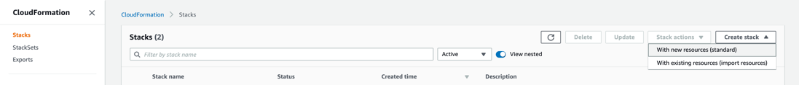

	- b.	In “Create Stack” Page, select “Template is ready” and for template source, select “Upload a template file”.
	- c.	Locate the DMSLab_Instructor_CFN.json template from your local machine.
	- d.	Click Next.

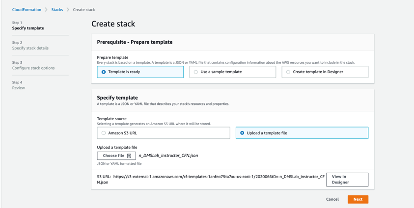 

e.	In Specify stack details, provide a name for Stack Name as “dmslab-instructor”.

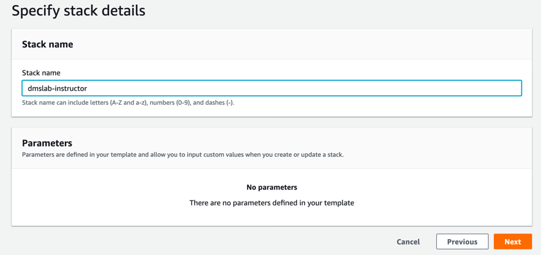

f.	Click on Next.
g.	In review page, review all the details, scroll down and check the box to acknowledge the policy and then click on Create Stack.

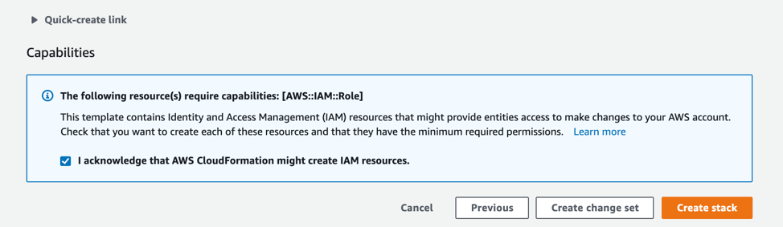

h.	Launch the stack. It may take 15 minutes for the stack to launch.
This stack creates a new VPC, Subnets, Security groups, EC2 instance, Route table, Routes, and an RDS Postgres instance. You can see all resources listed below:
 
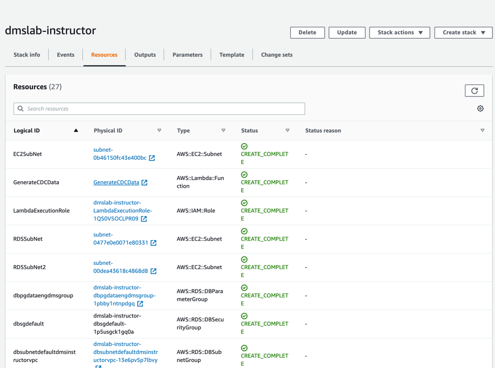

i.	Go to the Outputs tabs of AWS CloudFormation stack and note down the instance Endpoint information for your RDS endpoint, which will be similar to information shown in below screenshot

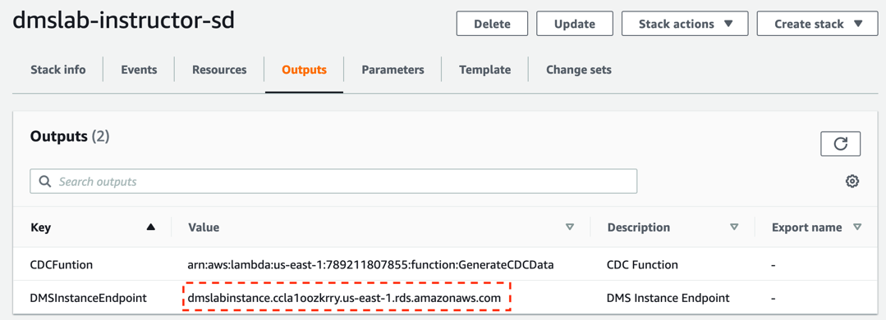

### Changing RDS Security Group

Currently your RDS source end point is not open to connect to outside world for security reason. You need to open RDS security group to accept traffic from intended range of IP address.  As it is difficult to determine range of IP address of workshop environment, so to have smooth experience of running lab you can temporally allow inbound traffic from all IP address (0.0.0.0/0 CIDR range). 
Warning: It is not best practice to allow ALL CIDR range in your database security group. You should never apply open to all IP CIDR range while working on actual workload. 
Follow below steps to open security group for students to connect with source RDS data base for DMS full data and CDC data dump:
1.	Go to the RDS and double click on “dmslabinstance” DB identifier as shown below:
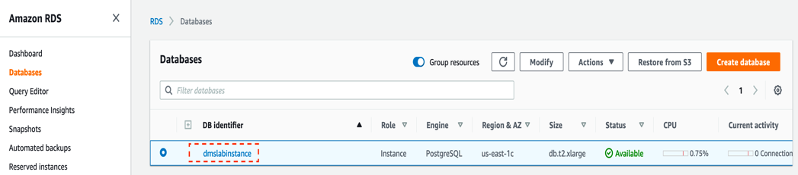
 
2.	Click VPC security groups under Connectivity & security tab as shown below:
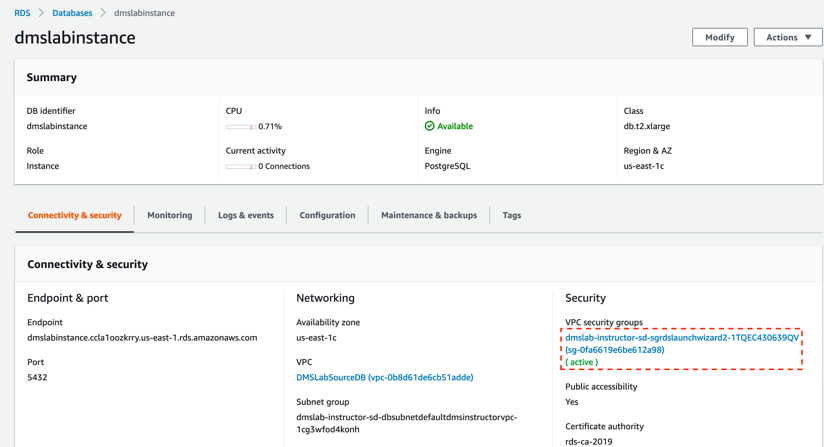 
3.	In Security group screen, Go to Inbound tab and click on Edit as shown below
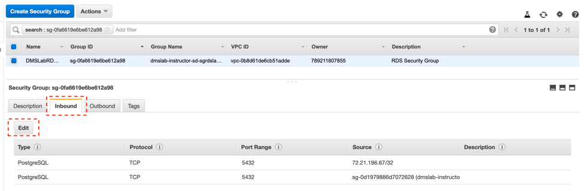
4.	Update Inbound rule to “Anywhere” from hardcoded value “72.21.196.67/32” , as shown in below screen. You can also update to your own IP address if want running both lab in same 

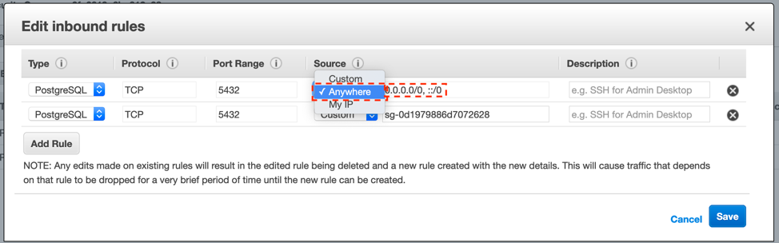

5.	Click on Save and now everyone will be able to connect to source RDS instance for lab purpose to ingest data using DMS endpoint. 
    
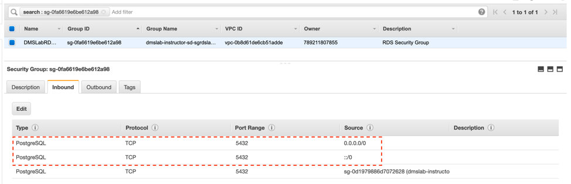
Note: Make sure to remove “Anywhere” inbound rule from security group as soon as you are done with DMS main lab.
Optionally, You can read though the documentation to better understand the source database environment. The GitHub repository for aws-database-migration-samples is located here: 
https://github.com/aws-samples/aws-database-migration-samples/tree/master/PostgreSQL/sampledb/v1

### Access Database from SQL Client (Optional)
You can follow below instruction to setup SQL Workbench to access your Postgres Database from SQL client:
https://aws.amazon.com/getting-started/tutorials/create-connect-postgresql-db/ 

In SQL Workbench:
Run following query to find out all Schema and table created.
SELECT * FROM pg_catalog.pg_tables; 

Use following query to analyze a table
select * from schemaname.tablename; 
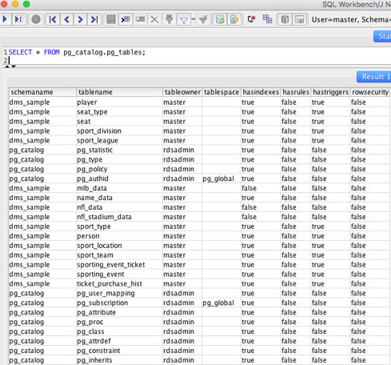
For example:
select * from dms_sample.player;
 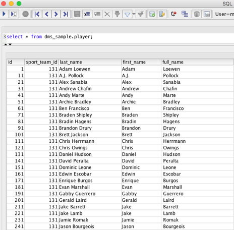

Following sections are optional you only need to execute, if you want to show change data capture replication with DMS. 

### Generate and Replicate the CDC Data (Optional)

When you want to generate transactions to demonstrate DMS CDC (Change Data Capture) functionality, navigate to Lambda console and you will see a pre-built Lambda function named “GenerateCDCData”.

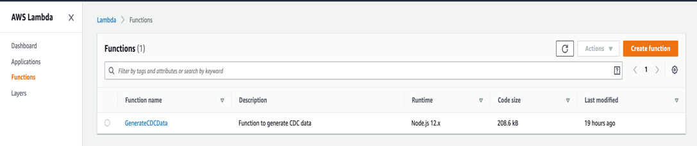

1.	Click on the function and scroll down. You will see the code for this function. Copy the below query and paste it in the placeholder (value) of this code line:
“ var query_cmd= ”<insert-SQL-query-here>” ”

2.	Run this query first: select dms_sample.generateticketactivity(10);

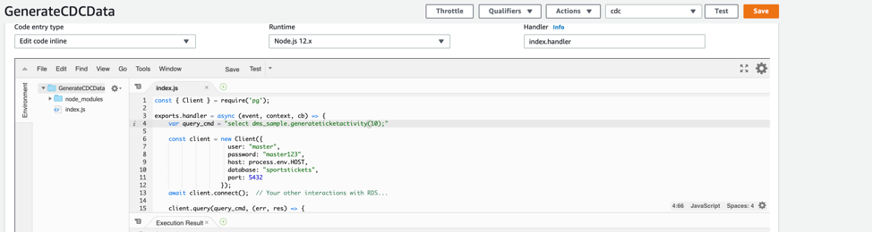 

This query will generate 10 ticket sales in batches of 1-6 tickets to randomly selected people for a random price (within a range.) A record of each transaction is recorded in the ticket_purchase_hist table. 
3.	Click on Save and then click on Test to run the function. You can create an empty event as shown here:
 
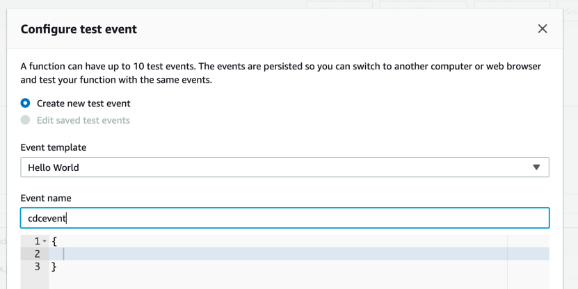
You will see no error in lambda log 
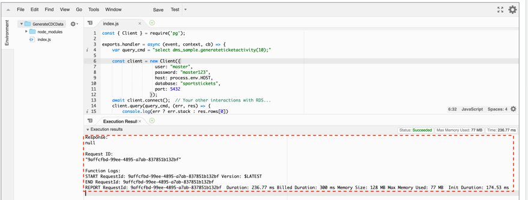
 
4.	Once you've sold some tickets you can run the generateTransferActivity procedure. The following will transfer tickets from the owner to another person. The whole "batch" of tickets purchased is transferred 80% of the time and 20% of the time an individual ticket is transferred.

Run this query next in the lambda function: 
**select dms_sample.generatetransferactivity(10);**

Click on **Save** and then click on **Test** to run the function.

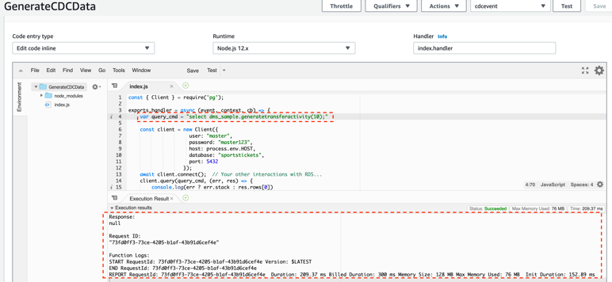 

`Note: `
When enabling CDC functionality in DMS, only one DMS instance/task should activate “Ongoing replication” to avoid conflicts. 
When replicating to multiple targets, the processing to fan out the updates should begin with the Amazon S3 bucket, that is the target of the DMS task responsible for Ongoing replication.  The process should not begin with the source database, as only one CDC process should be tracking and setting the last committed transaction that was replicated.