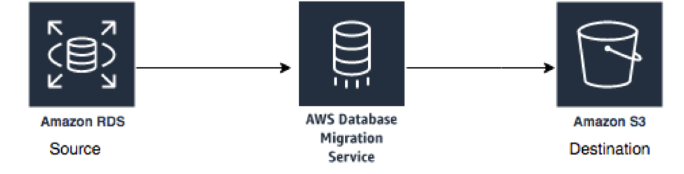
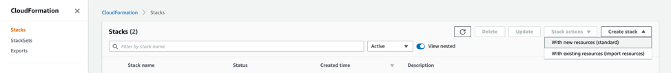
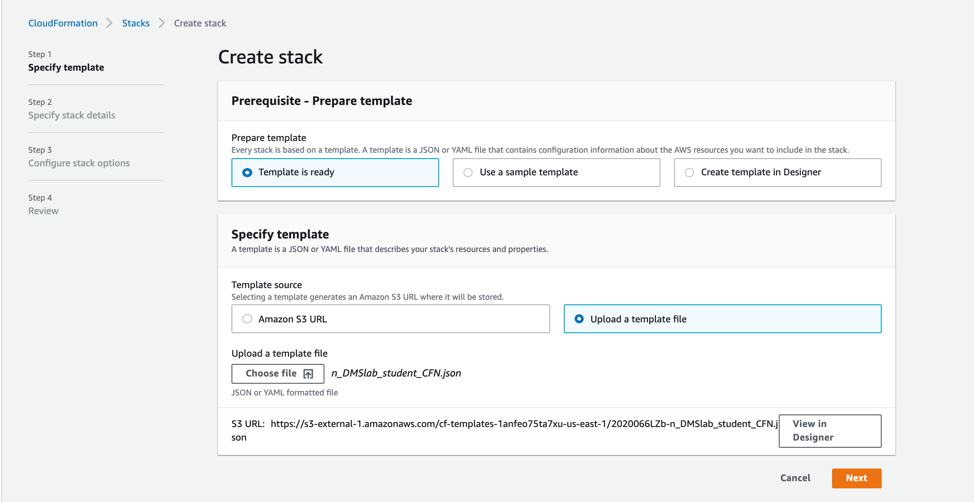
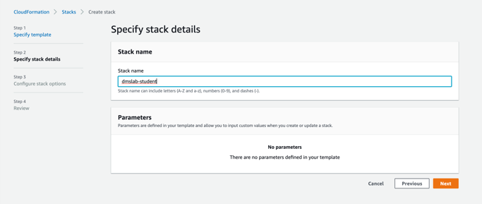
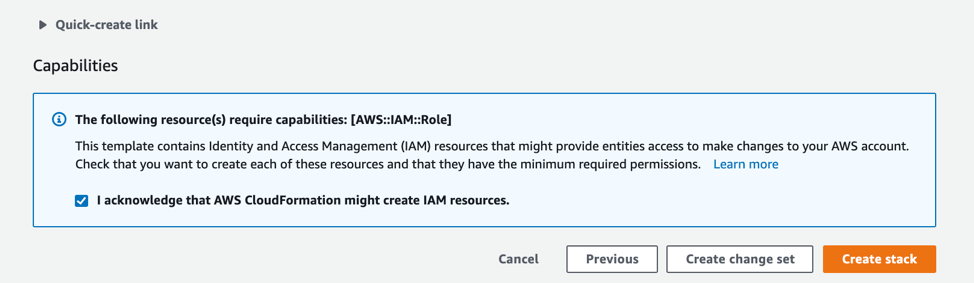
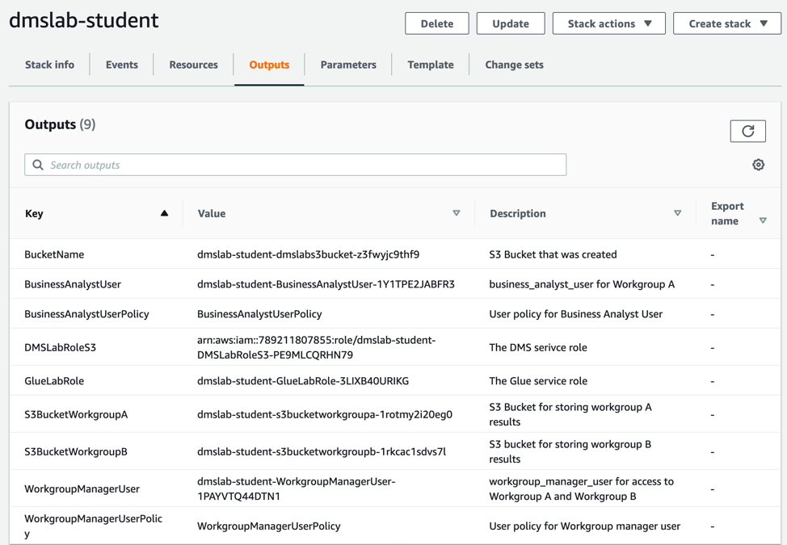

+++
title = "DMS PreLab Setup 2"
weight = 420
+++

### Steps
1. Introduction
2. Create the Student Environment

### Introduction

This guide helps students set up the pre-environment for the AWS Database Migration Service (AWS DMS) lab.

AWS DMS required source and destination as shown below:

Your instructor will provide you source database details during main lab to configure source endpoint. If you ran instructor lab to setup your own instance of Postgres database then use instance endpoint from instructor lab.

In this lab, you will complete the following pre-requisite using AWS CloudFormation template deployment:

1.	Create required VPC setup for AWS DMS instance.
2.	Create Amazon S3 bucket for destination end point configuration.
3.	Create Amazon S3 buckets for Amazon Athena query result storage.
4.	Create required Amazon S3 bucket policy to put data by AWS DMS service.
5.	Create AWS Glue Service Role to use in later hands-on workshop.
6.	Create Amazon Athena workgroup users to use in Athena workshop.
7.	Create Amazon Lake formation users to use in Lake formation workshop.

Labs are also available in GitHub - https://github.com/aws-samples/data-engineering-for-aws-immersion-day 
 
### Create the Student Environment
***Make sure you select the us-east-1 (Virginia) region***

1.	Sign in to the AWS console where you will host the student environment.

2.	Navigate to the AWS CloudFormation page.

3. Click the **Deploy to AWS** icons below to stand up the DMS pre-lab 1 workshop infrastructure.

|Launch Template| Region   |
|:--------------|:---------|
||**N.Virginia** (us-east-1)|

**or perform step below 3,4,5 manually**

3.	On top right corner, click on “Create Stack” and select “With new resources”.

 

4.	In “Create Stack” Page, select “Template is ready” and for template source, select “Upload a template file”.
5.	For this lab, you will be using [DMSLab_Student_CFN.json](./scripts/DMSlab_student_CFN.json) template.
6.	Click Next.

 
7.	In Specify stack details, provide a name for “Stack Name” as “dmslab-student”.
8.	Click on Next.
 
9.	In review page, review all the details, scroll down and check the box to acknowledge the policy and then click on Create Stack.
 

10.	Launch the stack. It may take 5 minutes for the stack to launch.  Go to the Outputs tab and note down all resource information in a notepad as you are going to use them in future labs:

**Congratulations!!!**  You have successfully completed student lab and setup all pre-requisite required to run rest of the workshop.
Please proceed to next lab Batch Data Ingestion with DMS.
