+++
title = "DMS Main Lab"
weight = 430
+++

### Steps
1. Introduction
2. Create the Subnet Group	
3. Create the Replication Instance	
4. Create the DMS Source Endpoint	
5. Create the Target Endpoint	
6. Create a task to perform the initial full copy	
7. Create the CDC endpoint to replicate ongoing changes (Optional)	
8. Create a task to perform the ongoing replication (Optional)
 
### Introduction

This lab will give you an understanding of the AWS Database Migration Service (AWS DMS).  You will migrate data from an existing Amazon Relational Database Service (Amazon RDS) Postgres database to an Amazon Simple Storage Service (Amazon S3) bucket that you create.

 

In this lab you will complete the following tasks:
1.	Create a subnet group within the DMS Lab VPC
2.	Create a DMS replication instance
3.	Create a source endpoint
4.	Create a target endpoint
5.	Create a task to perform the initial migration of the data.

Optionally, you can add ongoing replication of data changes on the source: (Only one of the DMS replication instances will enable this feature.)

6.	Create target endpoint for CDC files to place these files in a separate location than the initial load files
7.	Create a task to perform the ongoing replication of data changes

Your instructor has already created and populated the RDS Postgres database that you will use as your source endpoint in this lab. If you have deployed instructor lab, then get RDS endpoint from there.

Labs are also available in GitHub - https://github.com/aws-samples/data-engineering-for-aws-immersion-day 

### Create the Subnet Group

1.	On the DMS console, select Subnet Groups.

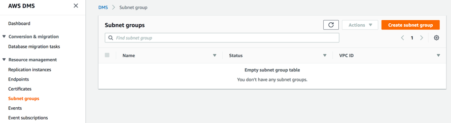  

2.	Click Create subnet group.
-  a.	In the Identifier box, type a descriptive name that you will easily recognize (e.g., “dms-lab-subnet-grp”).
-  b.	In the Description box, type an easily recognizable description (e.g., “Replication instance for production data system”).
-  c.	For VPC, select the name of the VPC that you created earlier with AWS CloudFormation template. VPC name ending with “dmslstudv1”.
The subnet list populates in the Available Subnets pane. 
-  d.	Select as many subnets as you want and click Add. The selected subnets move to the Subnet Group pane. Note: DMS requires at least two separate availability zones to be selected. 

 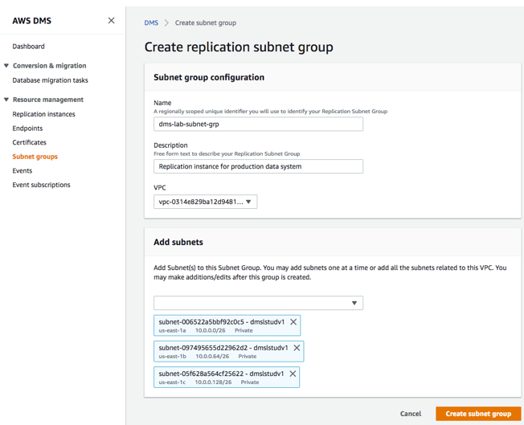  

3.	Click Create subnet group

4.	On the DMS console, the subnet group status displays Complete.

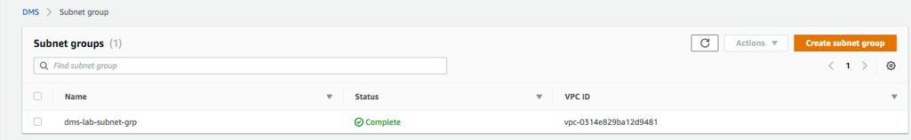   

### Create the Replication Instance

1.	On the DMS console, select Replication instances.
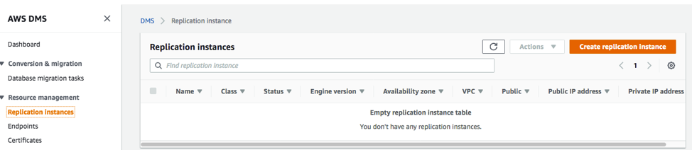   

2.	Click Create replication instance.

a.	For Name, type a name for the replication instance that you will easily recognize. (e.g., “DMS-Replication-Instance”).
b.	For Description, type a description you will easily recognize. (e.g., “DMS Replication Instance”).
c.	For Instance class, choose dms.t2.medium 
d.	Select Engine version as “3.3.1”
e.	For VPC, select the name of the VPC that you created earlier with AWS CloudFormation template. VPC name ending with “dmslstudv1”.	
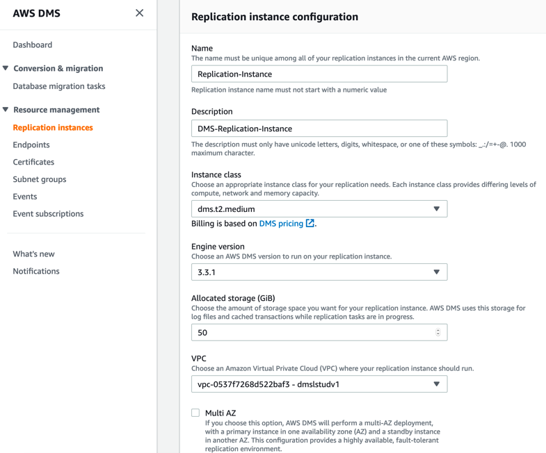   

f.	Click Advanced to expand the section.
g.	Select the security group with student-sgdefault in the name.
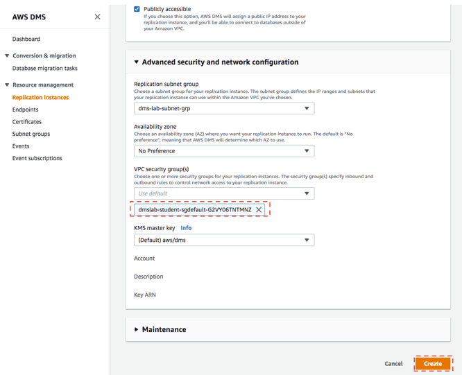   
3.	Click Create. 
4.	The DMS console displays creating for the instance status. When the replication instance is ready, the status changes to available. While replication instance is spinning up, you can proceed to next step for DMS endpoint creation.
 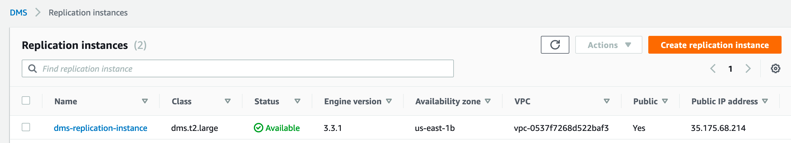 

### Create the DMS Source Endpoint 
Please proceed to create your endpoints, without waiting for the step above. 
1.	On the DMS console, select Endpoints
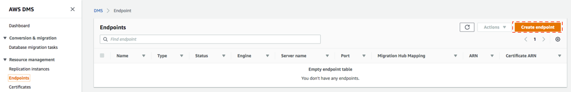  
 

2.	Click Create endpoint.
-  a.	select Source endpoint type.
-  b.	For Endpoint identifier, select your easily recognized name (e.g. “rds-source-endpoint”)	
-  c.	For Source engine, select “postgres”.
-  d.	Enter the Server name provided by your instructor, or if you ran instructor lab then take recorded endpoint from the instructor pre-lab. (e.g. “dmslabinstance.ccla1oozkrry.us-east-1.rds.amazonaws.com”)
-  e.	For Port, enter “5432”.
-  f.	For SSL mode, choose “none”.
-  g.	For User name, type “master”.
-  h.	For Password, type “master123”.
-  i.	For Database name, type “sportstickets”.
 
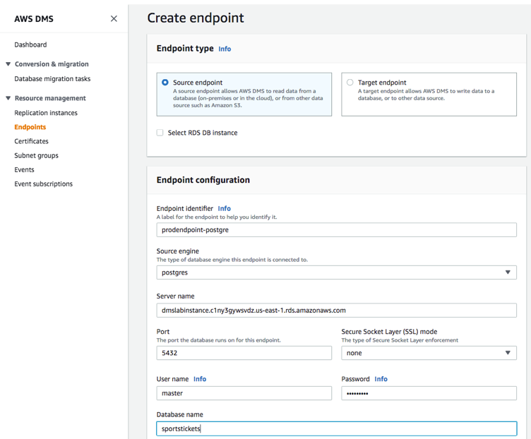  
3.	Click Create endpoint to create the endpoint. When available, the endpoint status changes to active. 

4.	Check the replication instance created previously. Make sure the status is available. 

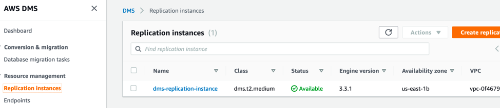   

5.	Select your newly created source endpoint, and choose Test connection on the Actions drop-down list.
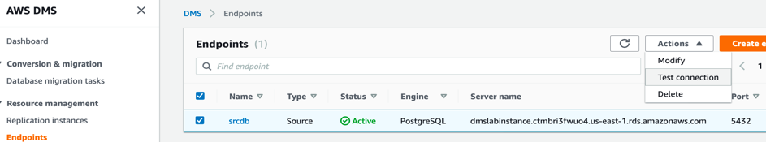   
 
6.	Click Run test. This step tests connectivity to the source database system. If successful, the message “Connection tested successfully” appears. 
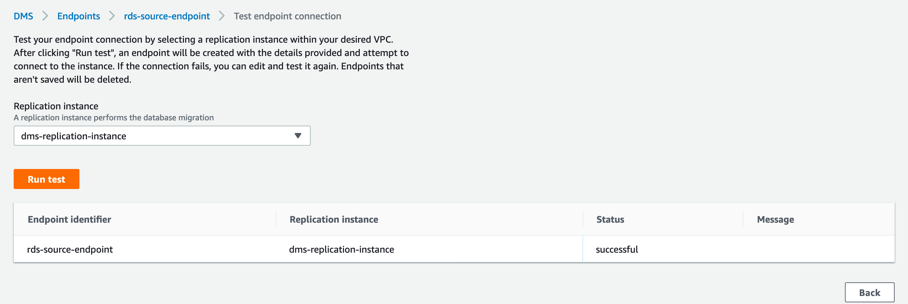   
 

Note for instructor: In case the test fail, two possible reasons: a) RDS security group restriction. To resolve this, revisit instructor lab and follow section “Changing RDS security Group” to troubleshoot. b) RDS is not accessible because its disk is full.  The solution is VACUUM FULL on the DB, or free up some disk space by deleting unnecessary auto-snapshots.

### Create the Target Endpoint
Before start, make sure you have the following information in-hand:
•	DMSLabRoleS3 ARN – It looks like “arn:aws:iam::<Account number>:role/xxx- DMSLabRoleS3-xxxx“
•	S3 Bucket Name - It looks like “xxx-dmslabs3bucket-xxxx“

1.	On the DMS console, select **Endpoints**.
   
 
2.	Click Create endpoint.
- a.	For Endpoint type, select “Target endpoint”.
- b.	For Endpoint identifier, type an easily recognized name such as “s3-target-endpoint”.
- c.	For Target engine, choose s3.
- d.	For Service access role ARN, paste the DMSLabRoleS3 ARN number noted earlier 
- e.	For Bucket name, paste the S3 Bucket Name noted earlier
- f.	For Bucket folder, type “tickets”.
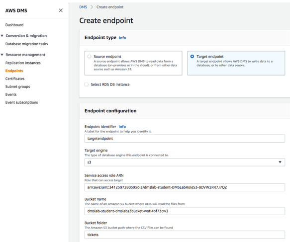

g.	Click Endpoint-specific settings to expand the section.
h.	In the Extra connection attributes box, type addColumnName=true. This attribute includes the column names in the files in the S3 bucket.
i.	Expand the Test endpoint connection (optional) section, and choose your “VPC name with dmslstudv1” on the VPC drop-down list.
j.	Click Run test. This step tests connectivity to the source database system. If successful, the message “Connection tested successfully” appears. 
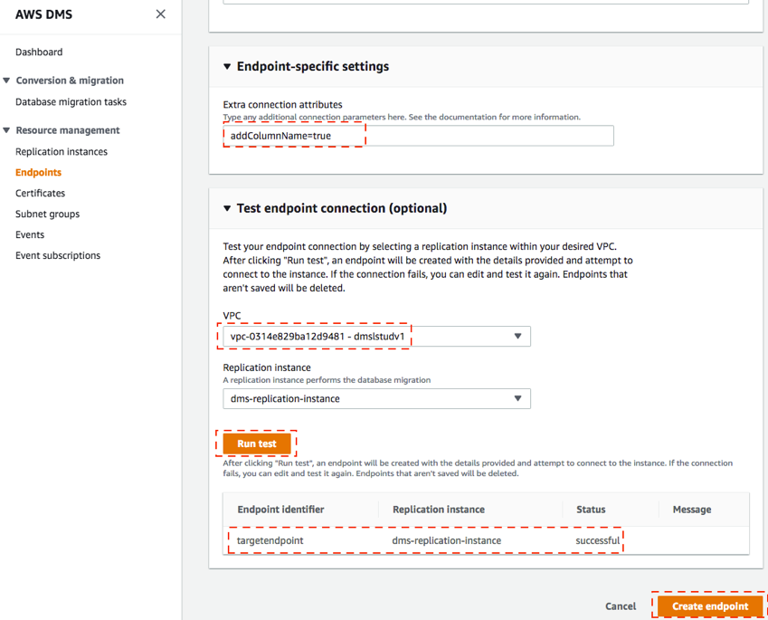
 

3.	Click Create Endpoint. When available, the endpoint status changes to active.
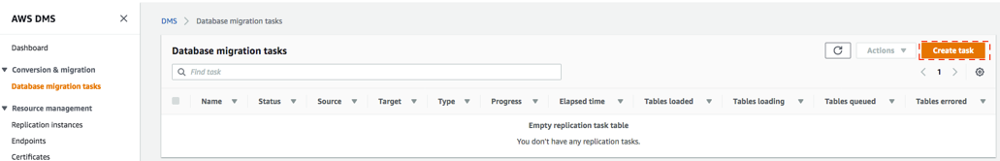
 
### Create a task to perform the initial full copy 

1.	On the DMS console, select **Database Migration Tasks**.
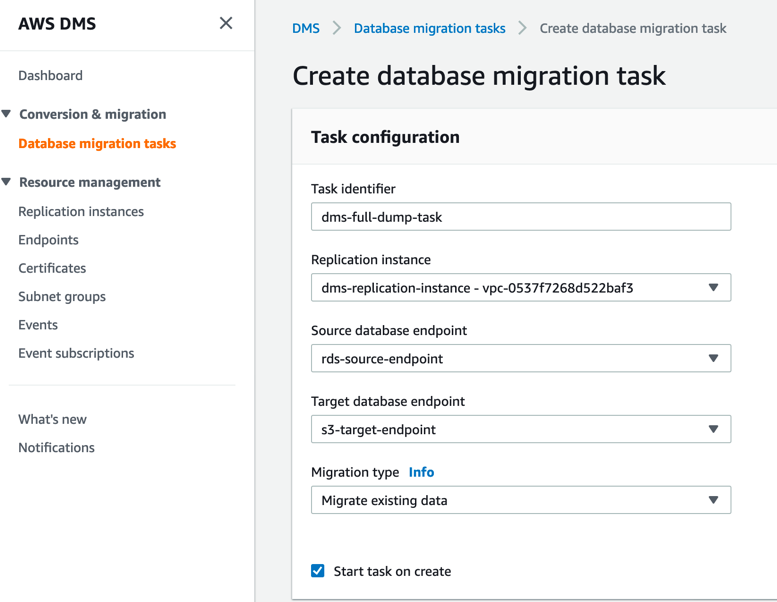

2.	Click Create Task.
- a.	Type an easily recognized Task name e.g. “dms-full-dump-task”. 
- b.	Select your Replication instance from drop down.
- c.	Select your Source endpoint from drop down.
- d.	Select your Target endpoint from drop down.
- e.	For, Migration type choose “Migrate existing data”.
- f.	Select “Start task on create” 
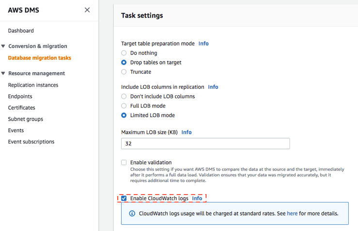
 
g.	Expand Task Settings.
h.	Select the Enable CloudWatch logs check box.  

 
i.	Go to Table Mappings.
j.	Click on Add new selection rule and select “Enter a Schema” in Schema field.
k.	For Schema name, select dms_sample . Keep the settings for the remaining fields 
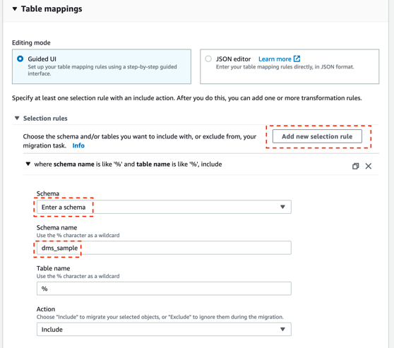
 

3.	Click Create task. Your task is created and starts automatically. (Note: The complete creation and data extraction process takes 5 to 15 minutes.)

4.	Once complete, the console displays 100% complete.
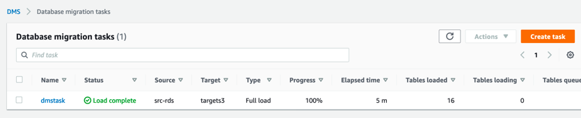
 

5.	Select your task and explore the summary. Scroll down and you can observe all table information loaded in S3 from RDS by DMS
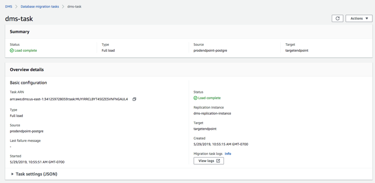
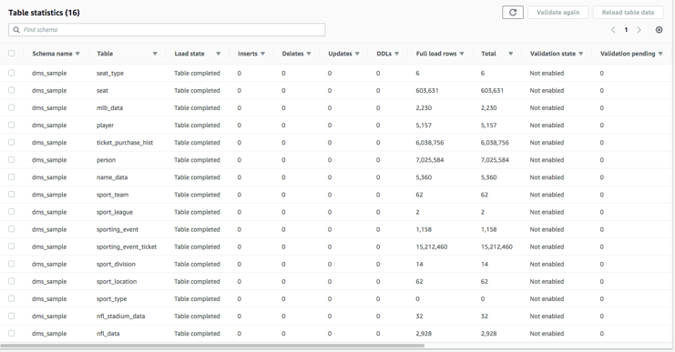

6.	Open the S3 console and view the data that was copied by DMS. 

Your S3 bucket name will look like below : BucketName/bucket_folder_name/schema_name/table_name/objects/        

In our lab example this becomes:   
 “/dmslab-student-dmslabs3bucket-woti4bf73cw3/tickets/dms_sample” with a separate path for each table_name)
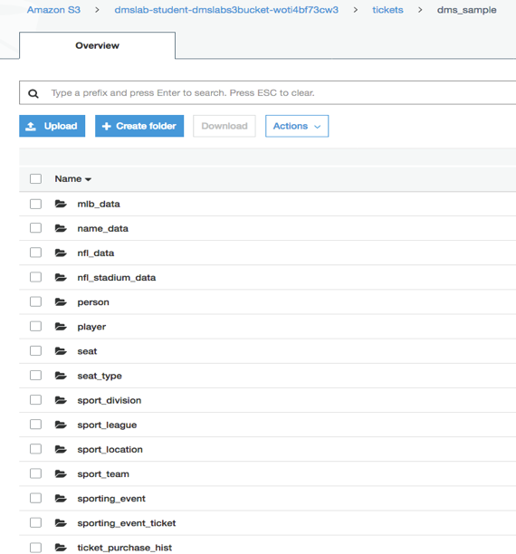
 

7.	Download one of the files:
a.	Select the check box next to the file name and click **Download** in the pop-up window. 
b.	Click **Save File**. 
c.	Open the file.  

You will notice that the file contains the column headers in the first row as requested by the “addColumnName=true” connection attribute we included when we created the s3 target endpoint. Note that column names are included in the file in the first row.
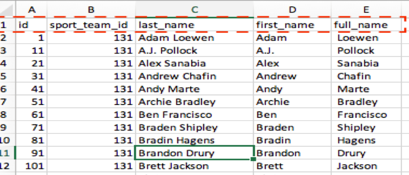 
Explore the objects in the S3 directory further.

### Create the CDC endpoint to replicate ongoing changes (Optional)

As of now we are enabling only one schema replication for CDC

1.	On the DMS console, select Endpoints.
 
 

2.	Click Create endpoint.
- a.	For Endpoint type, select “Target”.
- b.	For Endpoint identifier, type an easily recognized name that includes “rds-cdc-endpoint” in 
- c.	For Target engine, choose “s3”.
- d.	For Service Access Role ARN, paste the ARN value that you noted earlier from lab “prelab - Batch Data Ingestion with DMS - Student Setup”  
- e.	For Bucket name, type the name of the s3 bucket you noted down from from lab “prelab - Batch Data Ingestion with DMS - Student Setup” 
- f.	For Bucket folder, type “cdc”.
 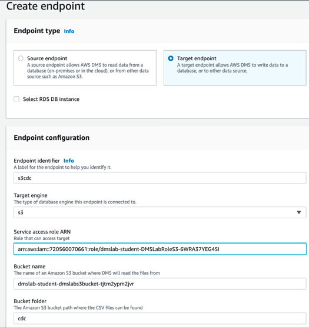

- g.	Click Endpoint-specific settings to expand the section.
- h.	 In the Extra connection attributes box, type “addColumnName=true”. This attribute includes the column names in the files in the S3 bucket.
- i.	Expand the Test endpoint connection (optional) section, and choose your dmslstudv1 name on the VPC drop-down list.
- j.	Click Run test. This step tests connectivity to the source database system. If successful, the message “Connection tested successfully” appears. 
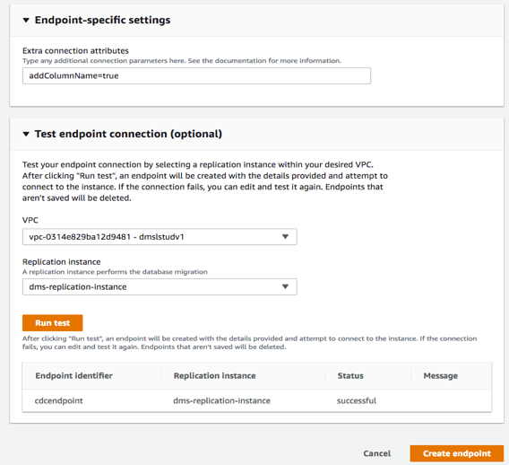
 
3.	Click Create endpoint.
4.	When available, the endpoint status changes to active.
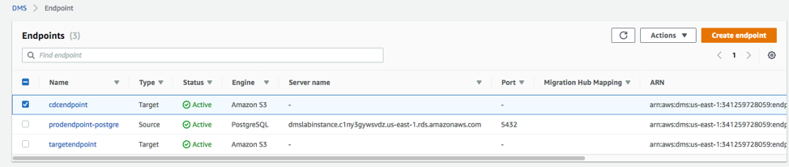

### Create a task to perform the ongoing replication (Optional)

1.	On the DMS console, select Database Migration Tasks.
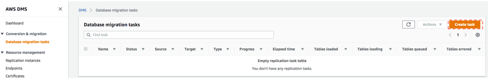
 

2.	Click Create Task.
- a.	Type an easily recognized Task Identifier.  For example “cdctask”.
- b.	Select your Replication instance.
- c.	Select your Source endpoint.
- d.	Select your Target endpoint as cdc endpoint created in the previous section.
- e.	For Migration type, choose Replicate data changes only.
- f.	Select the Start task on create check box.
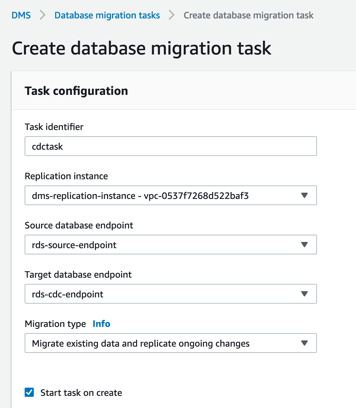
 

g.	In Task Settings, Select the Enable CloudWatch logs check box.  Do not enable the validation.

 

h.	Go to Table Mappings.
i.	Click on Add new selection rule and select “Enter a Schema” in Schema field.
j.	For Schema name, select “dms_sample” . Keep the settings for the remaining fields 

3.	Click Create task. Your task is created and starts automatically. You can see status as ongoing replication, after couple of minutes.
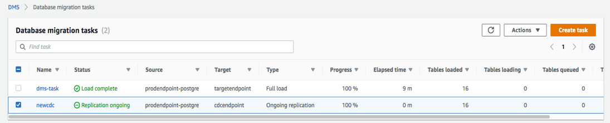

Once complete, the console displays 100% complete. 

4.	Your instructor will generate CDC activity which above migration task will capture, if you ran the instructor setup on your own, then make sure to follow **“Generate the CDC Data”** section from instructor lab. 

You may need to wait 5 to 10 minutes for CDC data to first reflect in your RDS postgres database and then picked up by DMS CDC migration task.

5.	Once the CDC Data gets replicated, you can navigate to CDC task details, scroll down to the “Table statistics” section and verify it, as shown below:

Note: In case you see DMS CDC task in fail/error status. Make sure your replication instance version is 3.3.1 and it is large enough (dms.t2.medium or above) to run CDC replication task 

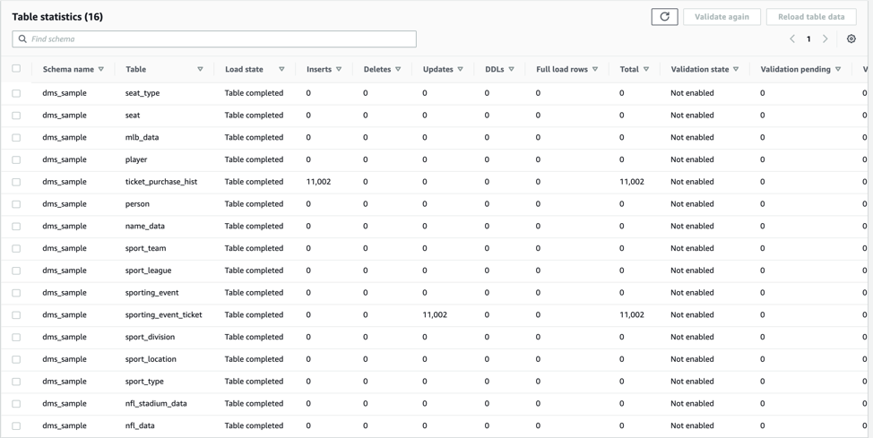

6.	Open the S3 console and view the CDC data that was copied by DMS. 

Your S3 bucket name will look like below : BucketName/bucket_folder_name/schema_name/table_name/objects/        

In our lab example this becomes:   
 “/dmslab-student-dmslabs3bucket-woti4bf73cw3/cdc/dms_sample” with a separate path for each table_name)

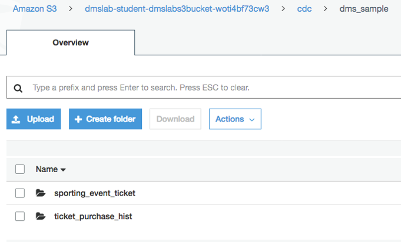

7.	Download one of the files:
- a.	Select the check box next to the object name and click Download in the pop-up window. 
- b.	Click Save File. 
- c.	Open the file.  
You will notice that the file contains the column headers in the first row as requested by the “addColumnName=true” connection attribute we included when we created the s3 target endpoint.

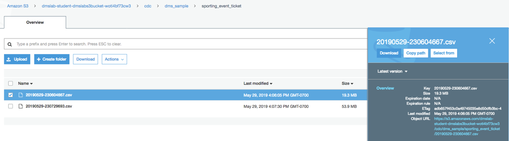

Note that file name has date time - 20190529-230604667.csv 

You can see the header is included and the operation column is added at the beginning of each row.  The file below shows updates (U) to the table along with the values after the update. Inserts (I) show data after the insert and Deletes (D) show data before the delete.
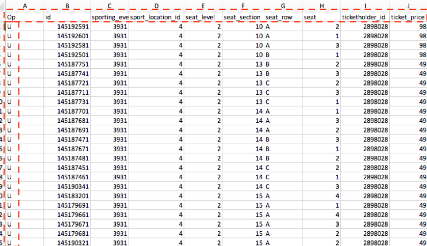

Explore the objects in the S3 directory further.
