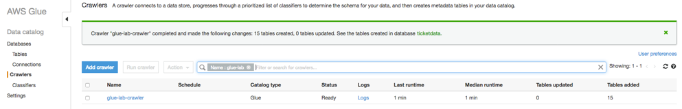
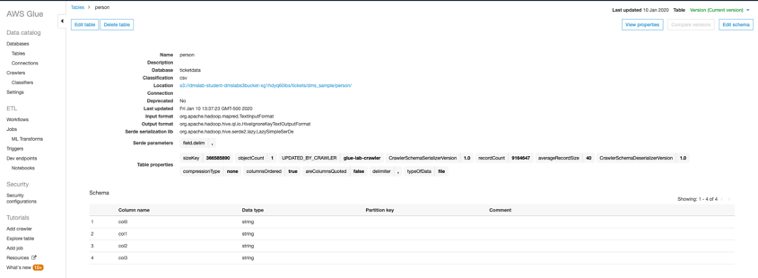
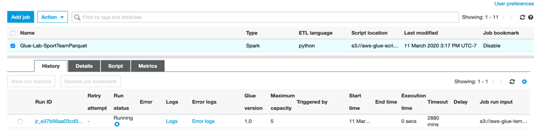
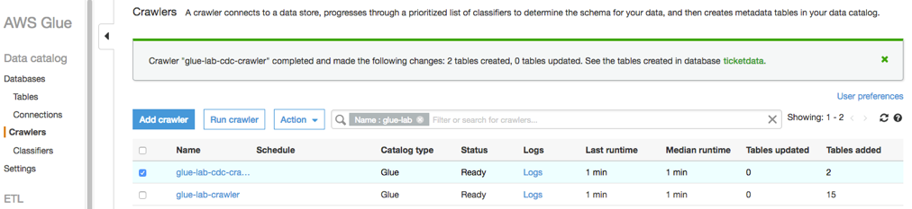
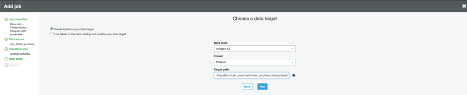
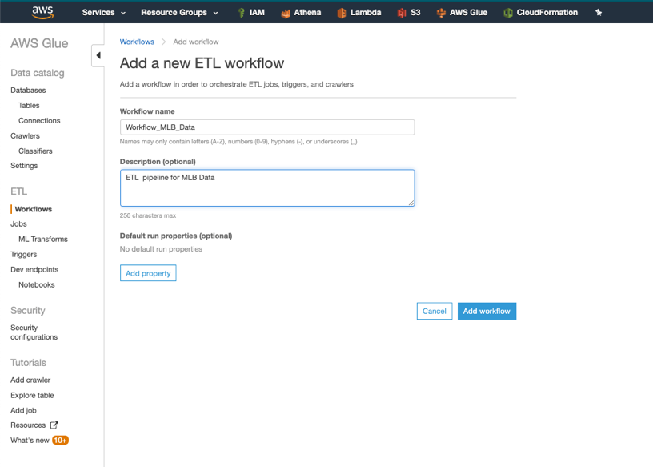

+++
title = "Transforming data with Glue"
weight = 610
+++

### Steps

- Tasks Completed in this Lab
- Getting Started
- PART-(A): Data Validation and ETL
    - Create Glue Crawler for initial full load data
    - Data ETL Exercise
    - Create Glue Crawler for Parquet Files
- PART-(B): Glue Job Bookmark (Optional)
    - Step 1: Create Glue Crawler for ongoing replication (CDC Data)
    - Step 2: Create a Glue Job with Bookmark Enabled
    - Step 3: Create Glue crawler for Parquet data in S3
    - Step 4: Generate CDC data and to observe bookmark functionality
- PART- ( C ): Glue Workflows (Optional)
    - Overview
    - Creating and Running Workflows
 
Labs are also available in GitHub - https://github.com/aws-samples/data-engineering-for-aws-immersion-day 

### Getting Started

Navigate to the AWS Glue service.
 
 
### PART-(A): Data Validation and ETL

Create Glue Crawler for initial full load data

1.	On the AWS Glue menu, select Crawlers.
 

2.	Click Add crawler. 
3.	Enter the crawler name for initial data load. This name should be descriptive and easily recognized (e.g ," glue-lab-crawler").
4.	Optionally, enter the description. This should also be descriptive and easily recognized and Click Next. 
 

5.	Choose Crawler Source Type as Data Source and Click Next
 

6.	On the Add a data store page, make the following selections:
    - a.	For Choose a data store, click the drop-down box and select S3.
    - b.	For Crawl data in, select Specified path in my account.
    - c.	For Include path, browse to the target folder for your DMS initial export, e.g., “s3://dmslab-student-dmslabs3bucket-woti4bf73cw3/tickets
7.	Click Next.
 

8.	On the Add another data store page, select No.  and Click Next.
 
9.	On the Choose an IAM role page, make the following selections:
    - a.	Select Choose an existing IAM role.
    - b.	For IAM role, select <stackname>-GlueLabRole-<RandomString> created from the AWS CloudFormation template during the student lab.  For example “dmslab-student-GlueLabRole-ZOQDII7JTBUM”

10.	Click Next. 
  

11.	On the Create a schedule for this crawler page, for Frequency, select Run on demand and Click Next.
 
 
12.	On the Configure the crawler’s output page, click Add database to create a new database for our Glue Catalogue. 
 

13.	Give Catalog database name as per your convenient choice for example “ticketdata” and click create
 

14.	For Prefix added to tables (optional), leave the field empty.
15.	For Configuration options (optional), select Add new columns only and keep the remaining default configuration options and Click Next.
 

16.	Review the summary page noting the Include path and Database output and Click Finish. The crawler is now ready to run.
  

17.	 Click Run it now. 
 
Crawler will change status from starting to stopping, wait until crawler comes back to ready state, you can see that it has created 15 tables.  
 
 
18.	In the AWS Glue navigation pane, click Databases > Tables. (You can also click the database name (e.g., "ticketdata" to browse the tables.). 
 

### Data Validation Exercise

1.	Within the Tables section of your ticketdata database, click the person table.
 

You may have noticed that some tables (such as person) have column headers such as col0,col1,col2,col3. In absence of headers or when the crawler cannot determine the header type, default column headers are specified.

This exercise uses the person table in an example of how to resolve this issue.

2.	Click Edit Schema on the top right side. 
 

3.	In the Edit Schema section, double-click col0 (column name) to open edit mode. Type “id” as the column name.
4.	Repeat the preceding step to change the remaining column names to match those shown in the following figure.
 
 
5.	Click Save. 

### Data ETL Exercise 

Pre-requisite: To store processed data you need new location. Please Follow this user guide to create folder following structure in your S3 bucket to store parquet file - https://docs.aws.amazon.com/AmazonS3/latest/user-guide/create-folder.html . 

Full path will look like e.g. – “s3://dmslab-student-dmslabs3bucket-woti4bf73cw3/tickets/dms_parquet/sport_team”
 
 

1.	In the left navigation pane, under ETL, click Jobs, and then click Add job.
 
 
2.	On the Job properties page, make the following selections:
    - a.	For Name, type “Glue-Lab-SportTeamParquet”
    - b.	For IAM role, choose existing role e.g. “dmslab-student-GlueLabRole-ZOQDII7JTBUM”
    - c.	For Type, Select “Spark”
    - d.	For Glue Version, select “Spark 2.4, Python 3(Glue version 1.0) “ or whichever is the latest version.
    - e.	For This job runs, select “A proposed script generated by AWS Glue”.
    - f.	For Script file name, type Glue-Lab-SportTeamParquet. 
    - g.	For S3 path where the script is stored, provide a unique Amazon S3 path to store the scripts. (You can keep the default for this lab.)
    - h.	For Temporary directory, provide a unique Amazon S3 directory for a temporary directory. (You can keep the default for this lab.)
 
3.	Click Next
4.	On the Choose your data sources page, select sport_team and Click Next.

 
5.	On the Choose a transformation type page, select change schema 
 
6.	On the Choose your data targets page, select Create tables in your data target.
7.	For Data store, select Amazon S3.
8.	For Format, select Parquet.
9.	For Target path, choose a folder location which you create at the beginning of this section to store the results e.g.,  " s3://dmslab-student-dmslabs3bucket-woti4bf73cw3/tickets/dms_parquet/sport_team"

10.	Click Next.

 

11.	Click the target Data type to edit the id schema mapping. In String type pop-up window Select double from Column type drop down and click update.


12.	 Click Save job and edit script.

13.	View the job. (This screen provides you with the ability to customize this script as required.) Click Save and then Run Job.

 
14.	In Parameters option, 
a.	you can leave Job bookmark as Disable.  AWS Glue tracks data that has already been processed during a previous run of an ETL job by persisting state information from the job run.
b.	You can leave the Job metrics option Unchecked. You can collect metrics about AWS Glue jobs and visualize them on the AWS Glue with job metrics.

 

15.	Click Run Job
16.	You will see job in now running as Run job button got disable. Click the cross button located in top right corner to close the window to return to the ETL jobs.


17.	Click your job to view history and verify that it ran successfully. 
 

You need to repeat the preceding steps to create new ETL Jobs to transform the additional tables. You will use transform data in next Athena lab.  You can continue creating below ETL job without waiting for previous job to finish. 

To enable us to join data, we will also update the target data types in the schema. If below Table1 is indicating need Schema changes as “Yes”. Refer Table 2 find out column which need to changes with source and target data type during ETL job creation.

#### Table 1:

| Job Name & Script Filename|Source Table|S3 Target Path|Need Schema Change?|
|:-------------------------:|:----------:|:------------:|:-----------------:|
|Glue-Lab-SportLocationParquet	| sport_location | dms_parquet/sport_location | No  |
Glue-Lab-SportingEventParquet   |   sporting_event  | dms_parquet/sporting_event  |   Yes |
Glue-Lab-SportingEventTicketParquet |   sporting_event_ticket   |   dms_parquet/sporting_event_ticket   | Yes |
Glue-Lab-PersonParquet  | person  | dms_parquet/person | Yes |

#### Table 2:

|Job Name	|Table	|Column	|Source Data Type	|Target Data Type|
|-----------|:-----:|:-----:|:-----------------:|---------------:|
Glue-Lab-SportingEventParquet	|sporting_event	|start_date_time	|STRING	|TIMESTAMP|
Glue-Lab-SportingEventParquet	|sporting_event	|start_date	|STRING	|DATE
Glue-Lab-SportingEventTicketParquet	|sporting_event_ticket	|id	|STRING	|DOUBLE|
Glue-Lab-SportingEventTicketParquet	|sporting_event_ticket	|sporting_event_id	|STRING	|DOUBLE|
Glue-Lab-SportingEventTicketParquet	|sporting_event_ticket	|ticketholder_id	|STRING	|DOUBLE|
Glue-Lab-PersonParquet	|person	|id		|STRING	|DOUBLE|

Once these jobs have completed, we can create a crawler to index these parquet files.
Create Glue Crawler for Parquet Files 
1.	In the AWS Glue navigation menu, click Crawlers, and then click Add crawler.


2.	For Crawler name, type “glue-lab-parquet-crawler” and Click Next.
 

3.	In next screen Specify crawler source type, select Data Source as choice for Crawler resource type and click Next.
4.	In Add a data store screen
    - a.	For Choose a data store, select “S3”.
    - b.	For Crawl data in, select “Specified path in account”. 
    - c.	For Include path, specify the S3 Path (Parent Parquet folder) that contains the nested parquet files e.g., s3://dmslab-student-dmslabs3bucket-woti4bf73cw3/tickets/dms_parquet
d.	Click Next.

5.	For Add another data store, select No and Click Next.

6.	On the Choose an IAM role page, select Choose an existing IAM role.
For IAM role, select the existing role “dmslab-student-GlueLabRole-ZOQDII7JTBUM” and Click Next.

7.	For Frequency, select “Run On Demand” and Click Next.

8.	For the crawler’s output database, choose your existing database which you created earlier e.g. “ticket-data”
9.	For the Prefix added to tables (optional), type "parquet_" 
 
10.	Review the summary page and click Finish.


11.	On the notification bar, click Run it now.

Once your crawler has finished running, you should report that 5 tables were added.


Confirm you can see the tables:
1.	In the left navigation pane, click Tables.
2.	Add the filter "parquet" to return the newly created tables.


### PART-(B): Glue Job Bookmark (Optional):
**Pre-requisite: Generate the CDC Data as part of DMS Lab**

#### Step 1: Create Glue Crawler for ongoing replication (CDC Data)

Now, let’s repeat this process to load the data from change data capture. 

1.	On the AWS Glue menu, select Crawlers.


2.	Click Add crawler.

3.	Enter the crawler name for ongoing replication. This name should be descriptive and easily recognized (e.g., " glue-lab-cdc-crawler").

4.	Optionally, enter the description. This should also be descriptive and easily recognized and Click Next.


5.	Choose Crawler Source Type as Data Source and Click Next


6.	On the Add a data store page, make the following selections:
a.	For Choose a data store, click the drop-down box and select S3.
b.	For Crawl data in, select Specified path in my account.
c.	For Include path, enter the target folder for your DMS ongoing replication, e.g., “s3://dmslab-student-dmslabs3bucket-woti4bf73cw3/cdc/dms_sample”
7.	Click Next.


8.	On the Add another data store page, select No and Click Next.


9.	On the Choose an IAM role page, make the following selections:
a.	Select Choose an existing IAM role.
b.	For IAM role, select <stackname>-GlueLabRole-<RandomString>. E.g. “dmslab-student-GlueLabRole-ZOQDII7JTBUM”

10.	Click Next.


11.	On the Create a schedule for this crawler page, for Frequency, select Run on demand and Click Next.


12.	On the Configure the crawler’s output page, select the existing Database for crawler output (e.g., "ticketdata"). 
13.	For Prefix added to tables (optional), specify "cdc_" 
14.	For Configuration options (optional), keep the default selections and click Next.

15.	Review the summary page noting the Include path and Database target and Click Finish. The crawler is now ready to run.

16.	Click Run it now.


17.	When the crawler is completed, you can see it has “Status” as Ready, Crawler will change status from starting to stopping, wait until crawler comes back to ready state, you can see that it has created 2 tables.  


18.	Click the database name (e.g., "ticketdata") to browse the tables. Specify "cdc" as the filter to list only newly imported tables.


#### Step 2: Create a Glue Job with Bookmark Enabled

1.	On the left-hand side of Glue Console, click on Jobs and then Click on Add Job
 

2.	On the Job properties page, make the following selections:
    - a.	For Name, type Glue-Lab-TicketHistory-Parquet-with-bookmark.
    - b.	For IAM role, choose existing role “dmslab-student-GlueLabRole-ZOQDII7JTBUM”
    - c.	For Type, Select Spark
    - d.	For Glue Version, select Spark 2.4, Python 3(Glue version 1.0) or whichever is the latest version.
    - e.	For This job runs, select A proposed script generated by AWS Glue.
    - f.	For Script file name, type Glue-Lab-TicketHistory-Parquet-with-bookmark. 
    - g.	For S3 path where the script is stored, provide a unique Amazon S3 path to store the scripts. (You can keep the default for this lab.)
    - h.	For Temporary directory, provide a unique Amazon S3 directory for a temporary directory. (You can keep the default for this lab.)
3.	Expand the Advanced properties section. For Job bookmark, select Enable from the drop down option.
4.	Expand on the Monitoring options, check for Job metrics.
5.	Click Next


6.	In Choose a data source, select cdc_ticket_purchase_hist as we are generating new data entries for ticket_purchase_hist table. Click Next


7.	In Choose a transform type, select Change Schema and Click Next


8.	In Choose a data target:
a.	For Data store: select amazon S3
b.	Format: parquet
c.	Target path: s3://<dms-lab-bucket-path>/cdc_bookmark/ticket_purchase_history_data/
d.	Click Next


9.	In map the source columns to target columns window, leave everything default and Click on Save job and edit script.


10.	 In the next window, review the job script and click on Run job. Click on close mark on the top right of the window to close the screen. 
 

11.	Once the job finishes its run, check the S3 bucket for the parquet partitioned data.


#### Step 3: Create Glue crawler for Parquet data in S3 
1.	Once you have the data in S3 bucket, navigate to Glue Console and now we will crawl the parquet data in S3 to create data catalog.
2.	Click on Add crawler


3.	 In crawler configuration window, provide crawler name as glue_lab_cdc_bookmark_crawler and Click Next.


4.	In specify crawler source type, for crawler source type, select Data stores. Click Next


5.	 In Add a data store:
    -   a.	For Choose a data store, select S3
    -   b.	For the path, provide this: s3://<dms-lab-bucket-path> and add /cdc_bookmark/ticket_purchase_history/. 
6.	Click on Next
 

7.	For Add another data store, select No and click Next.


8.	 In Choose an IAM role, select Choose an existing IAM role and select the role that you created as part of the DMS_Student Lab. (for eg, this role name looks something like this: dmslab-student-GlueLabRole-<random-alphanumeric-characters>
 

9.	 For setting the frequency in create a schedule for this crawler, select “Run on demand”. Click Next


10.	 For the crawler’s output:
    - a.	For Database, select “ticket” database.
    - b.	Optionally, add prefix to the newly created tables for easy identification. Provide the prefix as “bookmark_parquet_”
c.	Click Next
 

11.	 Review all the details and click on Finish. Next, run the crawler.


12.	 After the crawler finishes running, click on Databases, select “ticketdata” and view tables in this database. You will find the newly created table as “bookmark_parquet_ticket_purchase_history”


13.	 Once the table is created, click on Action and from dropdown select View Data. 


14. This will take you to Athena console and a prebuilt query will be run to display few entries of the table.  


15. Before moving on to next step, note the “recordcount” for “bookmark_parquet_ticket_purchase_history”. This will be used at the later part. In this example, the current count is: 1521922
 

#### Step 4: Generate CDC data and to observe bookmark functionality

Your instructor will generate CDC activity which above migration task will capture, if you ran the instructor setup on your own, then make sure to follow “Generate the CDC Data” section from instructor lab. 

You may need to wait 5 to 10 minutes for CDC data to first reflect in your RDS postgres database and then picked up by DMS CDC migration task.

1.	To make sure the new data has been successfully generated, check the S3 bucket for cdc data, you will see new files generated. Note the time when the files were generated. 

 

2.	Repeat Step 1 – Step 3. When you run the “glue-lab-cdc-crawler” again, you will see that it will only update the table with new data:


3.	Once the crawler finishes, note down the new record count after the table update. In this example, the new record count is: 1813493.
 

4.	Once you run the crawler In Step 3, select the “bookmark_parquet_ticket_purchase_history” from the Table section and click on Action->View Data. This will take you to Athena console. 
 


5.	On Athena Console, run the following query:
```
SELECT * FROM "ticketdata"."bookmark_parquet_ticket_purchase_history" 
order by transaction_date_time desc limit 100;
```


 
Run the same query against RDS instance, by connecting to your RDS instance through SQL Workbench.  (This has been covered in previous Lab, however, we are providing details for your convenience)

In SQL Workbench connection window, provide the following:
- a)	Driver: PostgreSQL (org.postgresql.Driver)
- b)	URL: jdbc:postgresql://<endpoint-rds-instance>:5432/sportstickets
- c)	Username: master
- d)	Password: master123


You will notice that the results for the column “transaction_date_time” and value of “purchase_price” is similar for the last 100 entries in SQL Workbench and in Athena Console. The result matches which shows that the new and latest has been replicated and stored in our table. 

Now let’s make sure that only the new data was scanned and added to the destination table by our Glue Job with Bookmark enabled. To validate the functioning of bookmark, timestamp values are used, in order to make sure only newly added data is scanned and added. In this example, “transaction_date_time” is the timestamp value used by Job Bookmark and will be used to showcase the functionality. 
Note the “transaction_date_time” value from the previous SQL query and then Run the following query:
```
SELECT count(*) FROM "ticketdata"."bookmark_parquet_ticket_purchase_history" 
where "transaction_date_time"='2020-01-26 04:34:37'
group by transaction_date_time
```
**"transaction_date_time"='2020-01-26 04:34:37'** is a subset of the newly added data. 
 
Since the data we are querying is a subset of newly added data, The result returned by this query should be less than or equal to the difference of record count for table: "bookmark_parquet_ticket_purchase_history" before and after running Glue Job with bookmark enabled.

In this example: (1813493-1521922)= 291571) >287839.

This validates that only new data was scanned and added by Glue job with bookmark enabled rather than scanning the entire data from source table and only new data entries were added to the destination table.

PS: Reference to timestamp is transaction_date_time value of the table which is used to show the bookmark functionality.

When you are building an enterprise use cases, it’s become important to automate entire pipeline and add notification. Please refer below blogs to try out end to end servlets datalike automation:

Build and automate a serverless data lake using an AWS Glue trigger for the Data Catalog and ETL jobs:
https://aws.amazon.com/blogs/big-data/build-and-automate-a-serverless-data-lake-using-an-aws-glue-trigger-for-the-data-catalog-and-etl-jobs/ 
### PART- ( C ): Glue Workflows (Optional)

#### Overview:
In AWS Glue, you can use workflows to create and visualize complex extract, transform, and load (ETL) activities involving multiple crawlers, jobs, and triggers. Each workflow manages the execution and monitoring of all its components. As a workflow runs each component, it records execution progress and status, providing you with an overview of the larger task and the details of each step. The AWS Glue console provides a visual representation of a workflow as a graph.

#### Creating and Running Workflows:
Above mentioned Part A (ETL with Glue) and Part B (Glue Job Bookmarks) can be created and executed using workflows. Complex ETL jobs involving multiple crawlers and jobs can also be created and executed using workflows in an automated fashion. Below is a simple example to demonstrate how to create and run workflows.

**Pre-requisite before creating workflow**
To store processed data you need new location. Please Follow this user guide to create folder following structure in your S3 bucket to store parquet file - https://docs.aws.amazon.com/AmazonS3/latest/user-guide/create-folder.html . 
Full path will look like e.g. – “s3://dmslab-student-dmslabs3bucket-woti4bf73cw3/tickets/dms_parquet/ mlb_data/data/”

You need to have Glue Jobs and Crawlers prebuilt in order to create workflow. For this exercise, we will select the table “mlb_data” from “ticketdata” database and create a glue job and crawler in a similar fashion as you created in Part A of this lab, with these details:
a)	Glue Job: 
-	Name: Glue-Lab-MLBParquet
-	Source: mlb_data table under ticket database
-	Transformation format: Parquet
-	Destination: s3://<dms-lab-bucket>/dms_parquet/mlb_data/data/

b)	Glue crawler: 
-	Name: glue-lab-mlbdata-crawler
-	Source: <dms-lab-bucket>/dms_parquet/mlb_data/data/
-	Destination Database: ticketdata 
-	Table prefix: workflow_

To create a workflow:
1.	Navigate to AWS Glue Console and under ETL, click on Workflows. Then Click on Add Workflow.


2.	Give the workflow name as “Workflow_MLB_Data”. Provide a description (optional) and click on Add Workflow to create it.


3.	Click on the workflow and scroll to the bottom of the page. You will see an option Add Trigger. Click on that button.


4.	In Add Trigger window, From Clone Existing and Add New options, click on Add New. 
a.	Provide Name as “trigger1”
b.	Provide a description: Trigger to start workflow
c.	Trigger type: On-demand. 
d.	Click on Add
Triggers are used to initiate the workflow and there are multiple ways to invoke the trigger. Any scheduled operation or any event can activate the trigger which in turn starts the workflow. 


5.	Click on trigger1 to add a new node. New Node can be a crawler or job, depending upon the workflow you want to build. Make sure you add node only after clicking on trigger so that whenever the “trigger1” is activated, it triggers job/crawler specified in the new node.


6.	Click on “Add Node”. A new window to add jobs or crawlers will open. Select the job Glue-Lab-MLBDataParquet


7.	Click on Glue-Lab-MLBDataParquet and Add Trigger will appear as shown in below screen.

 
8.	Click on Add trigger, provide the following:
- a.	Name: trigger2
- b.	Description: Trigger to execute crawler
- c.	Trigger type: Event
- d.	Trigger logic: Start after ALL watched event. This will make sure that crawler starts once Glue job finishes processing of ALL data. Click Add


9.	After trigger2 is added to workflow, Click on Add node which is connected to trigger 2 as highlight below:

 
10.	 Select crawler option and then chose “glue-lab-mlbdata-crawler”. Click Add.


11.	 Now click on an empty grid and workflow will look like below:


12.	 Select your workflow, click on Actions->Run and this will start the first trigger “trigger1”


13.	Now the first node will be executed, i.e. Glue Job and subsequently all other nodes will be executed.
14.	Once finished, the workflow will be shown as completed.
15.	You can click on any node at any time of processing of workflow, to get more details about that particular stage of processing. This gives you detailed level view for monitoring your pipeline.

 
16.	Once the workflow is completed, you will observe that glue job and crawlers have been successfully executed and the table has been created.


 
17.	Let’s query the data in Athena. Select “workflow_mlb_data” table and click on Actions->View Data.

 
**Congratulations!! You have successfully completed this lab**
