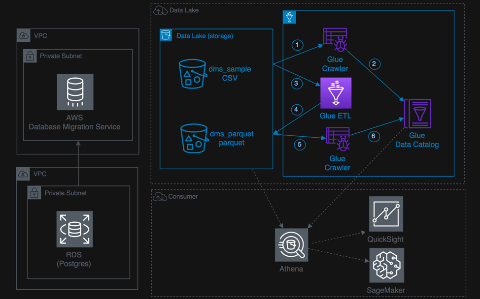

+++
title = "06 Lab: Transforming data with Glue"
weight = 600
+++

### Introduction

This lab will give you an understanding of the AWS Glue – a fully managed data catalog and ETL service.

 

### Prerequisites:

The DMS Lab is a prerequisite for this lab.

Below is a list of the steps for this lab:

{}