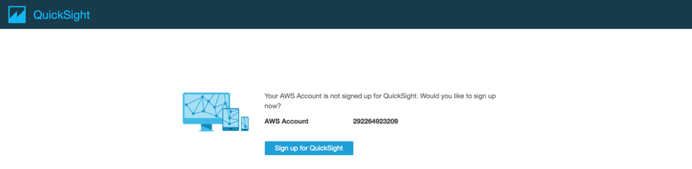
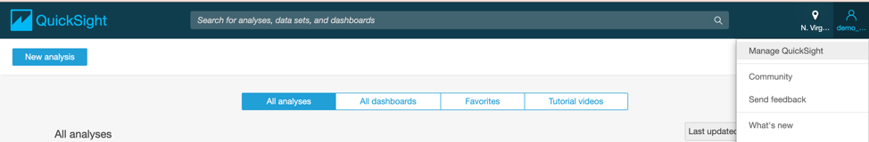
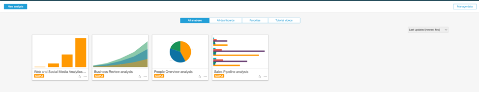
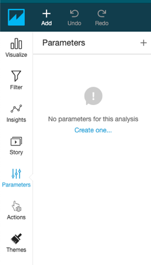
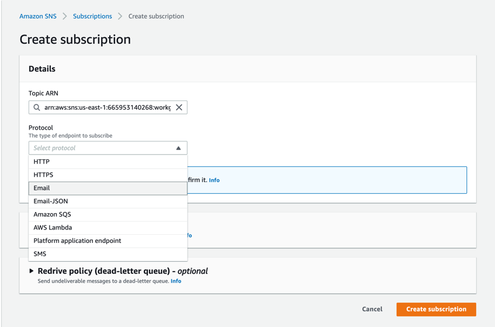

+++
title = "Athena and QuickSight"
weight = 810
+++
 
### Steps	
- Prerequisites	
- Getting Started	
- Query Data with Amazon Athena	
- Build an Amazon QuickSight Dashboard	
- Set up QuickSight	
- Create QuickSight Charts	
- Create QuickSight Parameters	
- Create a QuickSight Filter	
- Add Calculated Fields	
- Amazon QuickSight ML-Insights (Optional)	
- Athena Workgroups to Control Query Access and Costs (Optional)	
- Workflow setup to separate workloads	
- Explore the features of workgroups	
- Managing Query Usage and Cost	
- Cost Allocation Tags	
 
### Prerequisites
The DMS Lab and Glue ETL lab is a prerequisite for this lab.

### Getting Started
In this lab, you will complete the following tasks:

1.	Query data and create a view with Amazon Athena
2.	Athena Workgroups to Control Query Access and Costs
3.	Build a dashboard with Amazon QuickSight

### Query Data with Amazon Athena

1.	In the AWS services console, search for Athena.


2.	If you are using Athena first time, click on “Get Started” button in introduction screen.

 
3.	Setup the S3 buckets to store the query results. For this, Navigate to S3 console, click on bucket created as part of student lab (for e.g: <dmslab-student-dmslabs3bucket-xg1hdyq60ibs>). Inside bucket, click on “create folder”. Name folder as “athenaquery”. Click on “Save”.


4.	Note down the path of S3 folder created above and save it. 
 
5.	In Athena Console, click on Settings. 

6.	Copy paste the folder path as shown below:
 
7.	In the Query Editor, select your newly created database e.g., "ticketdata”.

8.	Click the table named "parquet_sporting_event_ticket" to inspect the fields.

Note: The type for fields id, sporting_event_id and ticketholder_id should be (double).

 

Next, we will query across tables parquet_sporting_event, parquet_sport_team, and parquet_sport location.

9.	Copy the following SQL syntax into the New Query 1 tab and click Run Query.
```
SELECT 
    e.id AS event_id,
    e.sport_type_name AS sport,
    e.start_date_time AS event_date_time,
    h.name AS home_team,
    a.name AS away_team,
    l.name AS location,
    l.city
FROM parquet_sporting_event e,
    parquet_sport_team h,
    parquet_sport_team a,
    parquet_sport_location l
WHERE 
    e.home_team_id = h.id 
    AND e.away_team_id = a.id 
    AND e.location_id = l.id;
```
The results appear beneath the query window.

 

10.	 As shown above Click Create and then select Create view from query
11.	Name the view "sporting_event_info" and click Create.

 

Your new view is created 

 

12.	 Copy the following SQL syntax into the New Query 2 tab and click on Save Query.
```
SELECT t.id AS ticket_id,
    e.event_id,
    e.sport,
    e.event_date_time,
    e.home_team,
    e.away_team,
    e.location,
    e.city,
    t.seat_level,
    t.seat_section,
    t.seat_row,
    t.seat,
    t.ticket_price,
    p.full_name AS ticketholder
FROM sporting_event_info e,
    parquet_sporting_event_ticket t,
    parquet_person p
WHERE 
    t.sporting_event_id = e.event_id
    AND t.ticketholder_id = p.id
```

 
Clikc on Save as button Give this query a name: create_view_sporting_event_ticket_info and some description and then, click on Save. 

 

Back to the query editor, you will see the query name changed. Now, click on ¬-Run Query.
 
The results appear beneath the query window.

 

13.	As shown above Click Create view from query.
14.	Name the view "sporting_event_ticket_info" and click Create.


15.	Copy the following SQL syntax into the New Query 3 tab.
```
SELECT 
  sport, 
  count(distinct location) as locations, 
  count(distinct event_id) as events, 
  count(*) as tickets,
  avg(ticket_price) as avg_ticket_price
FROM sporting_event_ticket_info 
GROUP BY 1
ORDER BY 1;
```
Click on Save Query and give this query name: analytics_sporting_event_ticket_info and some description and then, click on Save.

 

The name of the New Query 3 will be changed to one assigned in previous step. Click on **Run Quer**y.
 
You query returns two results in approximately five seconds. The query scans 25 MB of data, which prior to converting to parquet, would have been 1.59GB of CSV files.

 

The purpose of saving the queries is to have clear distinction between the results of the queries running on one view. Otherwise, your query results will be saved under “Unsaved” folder within the S3 bucket location provided to Athena to store query results. Please navigate to S3 bucket to observe these changes, as shown below:
 
Build an Amazon QuickSight Dashboard

Set up QuickSight

1.	In the AWS services console, search for QuickSight.

 

If this is the first time you have used QuickSight, you are prompted to create an account. 
2.	Click Sign up for QuickSight.

 

3.	For account type, choose Standard. If you plan to complete the Bonus Exercise, please choose Enterprise Version
4.	Click Continue.
 

5.	On the Create your QuickSight account page, fill out your name and email address.
6.	Select region and the check boxes to enable autodiscovery, Amazon Athena, and Amazon S3.
7.	Click Choose S3 buckets and select your DMS bucket (e.g., "dmslab-student-"). 
8.	Click Finish.

 
9.	On the QuickSight landing page, on the top right corner, click on “Manage QuickSight.

 
10.	Choose “Security and Permissions” and under “QuickSight access to AWS Services, click on “Add or Remove” button.
 
11.	 If you will observe there is an unchecked box against S3 buckets for “dmslab-student-“, please check the box.  

12.	 Select Amazon S3. Select the S3 bucket created as part of student lab (for e.g: dmslab-student-dmslabs3bucket-xg1hdyq60ibs) which will have all the folders for your source data. 

 
13.	Then, click on Finish. 
 
14.	You will observe that now there is a check mark in the checkbox for Amazon S3. This confirms that QuickSight has required permissions. Then, click on “Update”.
 

15.	Navigate to QuickSight landing page by clicking on the QuickSight logo on the top left. On the top right corner, click Manage Data.
 

16.	Click New Data Set.
 
17.	On the Create a Data Set page, select Athena as the data source.

 

18.	For Data source name, type “ticketdata-qs" and click Validate connection.
19.	Click Create data source.

 

20.	In the Database drop-down list, select the database name you created in the AWS Glue lab.
21.	Choose the "sporting_event_ticket_info" table and click Select.

 

22.	To finish data set creation, choose the option Import to SPICE for quicker analytics and click Visualize.

 
You will now be taken to the QuickSight Visualize interface where you can start building your dashboard.  

 
**Note**: The SPICE dataset will take a few minutes to be built, but you can continue to create some charts on the underlying data.

### Create QuickSight Charts

In this section we will take you through some of the different chart types.

1.	In the Fields list, click the "**ticket_price**" column to populate the chart. 
2.	Click the **expand** icon in corner of "ticket_price" field and select format as **currency** to show numbers in dollar amount.


3.	You can add new visual and keep building your dashboard by clicking Add button at top left corner of screen. 
In the Visual types area, choose the Vertical bar chart icon. 
This layout requires a value for the X-axis. In Fields list, select the "event_date_time" field and you should see the visualization update.
For Y-axis, select “ticket_price” from the Field list.

 
4.	Add new Visual and you can drag and move other visuals to adjust space in dashboard. In the Fields list, click and drag the seat_level field to the Group/Color box in the Field wells pane. You can also use the slider below the x axis to fit all of the data.
 

Let’s build on this one step further by changing the chart type to "Clustered bar combo chart" and adding in the ticketholder field for the Lines. 
5.	In the Visual types area, choose the Clustered bar combo chart icon. 
6.	In the Fields list, click and drag the ticketholder field to the Lines box in the Field wells pane. 
7.	In the Field wells pane, click the Lines box and choose Count Distinct for Aggregate. You can then see the y-axis update on the right-hand side.

 

8.	Click on insight icon on the left tabs section and explore insight information in simple English.

 

Feel free to experiment with other chart types and different fields to get a sense of the data.

### Create QuickSight Parameters

In the next section we are going to create some parameters with controls for the dashboard, then assign these to a filter for all the visuals.

1.	In the left navigation menu, select Parameters.

 
2.	Click Create one to create a new parameter with a Name.
3.	For Name, type EventFrom.
4.	For Data type, choose Datetime.
5.	For Default value, select the value from calendar as start date available in your graph for event_date_time. For example, 2020-01-01 00:00. 
6.	Click Create, and then close the Parameter Added dialog box.

 

7.	Create another parameter with the following attributes:
a.	Name: EventTo 
b.	Data type: Datetime
c.	For Default value, select the value from calendar as end date available in your graph for event_date_time. For example, 2021-01-01 00:00
d.	Click Create

 

8.	In next window, you can select any option to perform any operation with the parameter. Alternatively, you can click the drop-down menu for the EventFrom parameter and choose Add control.

 

9.	 Click on Control
10.	For Display name, specify Event From and click Add.

 

11.	Repeat the process to add a control for EventTo with display name Event To.

 

You should now be able to see and expand the Controls section above the chart.

 

### Create a QuickSight Filter

To complete the process, we will wire up a filter to these controls for all visuals.

1.	In the left navigation menu, choose Filter.
2.	Click the plus icon (+) to add a filter for the field "event_date_time".

 

3.	Click this filter to edit the properties.

 

4.	Choose to make this filter apply to All visuals.
5.	For Filter type, choose Time range and Between. 
6.	Select option Use Parameter.
7.	For Start date parameter, choose EventFrom.
8.	For End date parameter, choose EventTo.
9.	Click Apply.

 

### Add Calculated Fields

In the next section, you will learn, how to add calculated fields for "day of week" and "hour of day" to your dataset and a new scatter plot for these two dependent variables.

1.	Click the Add button on the top left and select Add a calculated field.

 

2.	For Calculated field name type “event_day_of_week".
3.	For Formula, type  extract(“WD",{event_date_time})
Note: extract returns a specified portion of a date value. Requesting a time-related portion of a date that doesn't contain time information returns 0. WD: This returns the day of the week as an integer, with Sunday as 1.
4.	Click Create.

 

5.	Add another calculated field with the following attributes:
a.	Calculated field name: "event_hour_of_day"
b.	Formula: extract("HH",{event_date_time})
Note: HH: This returns the hour portion of the date.

 

6.	Click Add button in the top left and choose Add visual.

 

7.	For field type, select the scatter plot.
8.	In the Fields list, select and drag the following attributes to the Field wells pane to set the graph attributes:
    - a.	X-axis: "event_hour_of_day"
    - b.	Y-axis: "event_day_of_week" 
    - c.	Size: "ticket_price"


Since now you have completed your dashboard then you can publish it by clicking on top right corner of screen.


A dashboard is a read-only snapshot of an analysis that you can share with other Amazon QuickSight users for reporting purposes. In Dashboard other users can still play with visuals and data but that will not modify dataset. 

You can share an analysis with one or more other users with whom you want to collaborate on creating visuals. Analysis provide other uses to write and modify data set.

### Amazon QuickSight ML-Insights (Optional)
With Amazon QuickSight, you can add Machine Learning capabilities to your visuals, easily, with one click action. There are 3 types of Machine Learning Insights
•	Narrative 
•	Anomaly Detection
•	Forecasting 
ML-Insights is only available to enterprise version of QuickSight. You will need to upgrade to Enterprise Edition before you start with the task. To upgrade your Amazon QuickSight Subscription from Standard Edition to Enterprise Edition please follow this guide https://docs.aws.amazon.com/quicksight/latest/user/upgrading-subscription.html 

Let’s see how we can add a bit of forecasting in our dashboard. Forecasting works with timeseries, which is better represented with a line graph. Let’s first create a line graph. 
1.	Click add Visual at top left corner of screen, and select Line Chart and add the event_date_time as the x-axis and aggregate by week. As shown in below screenshot

2.	Add forecasting to the visual. To do that, click on the drop-down arrow on the top right corner of the visual, and then click Add forecast. 
 
The visual will add forecast, you can hover over and explore forecasted data as shown below. Feel free to explore with the properties of the forecast algorithm. 
 

*Congratulations!! You have successfully completed this lab, Continue to Next section if you want to dive deep into Athena query access and cost.*

### Athena Workgroups to Control Query Access and Costs (Optional)

Use workgroups to separate users, teams, applications, or workloads, to set limits on amount of data each query or the entire workgroup can process, and to track costs. Because workgroups act as resources, you can use resource-level identity-based policies to control access to a specific workgroup. You can also view query-related metrics in Amazon CloudWatch, control costs by configuring limits on the amount of data scanned, create thresholds, and trigger actions, such as Amazon SNS, when these thresholds are breached.

Workflow setup to separate workloads

For this lab, we will create two workgroups: “workgroupA” and “workgroupB”. Before creating the workgroups, you need to have users, appropriate IAM policies to assigned to each user and S3 buckets to store the query results. This has been created using Cloud Formation template for your convenience. It is recommended to go through the template for better understanding of pre-requisites. We will have two users: “business_analyst_user” and “workgroup_manager_user” created in IAM with different policies: 
-	The business_analyst_user will have access to workgroupA and query sporting_event_info table. 
-	The workgroup_manager_user will have access to both workgroups workgroupA and workgroupB for management purposes. 

The resources have been already created as part of the DMS Student lab. You can click on the CloudFormation stack and navigate to “Resources” to understand the different resources created with “DMSlab_student_CFN.json” template. Navigate to outputs section to see the results of resources created with description.


We will utilize the values from the outputs wherever required in the following steps.

**Now we will create workgroups.**
1.	Navigate to Athena Console and click on “Workgroup: primary”. The default workgroup provided for querying in Athena is “primary”.


2.	Click on “Create workgroup”
 

3.	 Provide the following:
- a.	Workgroup Name: “workgroupA”
- b.	Description: (optional): 
    - i.	“workgroupA for BusinessAnalystUser”  
    - ii.	“workgroupB for workgroup manager user”
- c.	Query result location: Provide the query location, You can find S3 bucket name from Cloudformation output tab of student lab
    - i.	For workgroupA, the s3 path would look something like: “s3:// dmslab-student-s3bucketworkgroupa-ldtj44qkwyle/”. 
    - ii.	For workgroupB, provide S3 path as: “s3://dmslab-student-s3bucketworkgroupb-n2jrw40pfqcc/”. 
- d.	For “Encrypt query results”, leave as default i.e. unchecked. You can check this if you want your query results to be encrypted. 
- e.	Check the checkbox for “Metrics: Publish query metrics to AWS CloudWatch”

 

4.	 Provide the following:
- a.	Optionally, you can click on Override client-side settings. This will override the client-side settings and keep the defaults for query execution and storing results.
- b.	Tag your workgroup to analyze later with CloudWatch or perform any analytics on query execution and results.
    - i.	For workgroupA:  provide key:”name”, value:”workgroupA”
    - ii.	For workgroupB: Provide key:”name”, value:”workgroupB”
- c.	For “Requester Pays S3 buckets”, keep as default. This is Optional. Choose Enable queries on Requester Pays buckets in Amazon S3 if workgroup users will run queries on data stored in Amazon S3 buckets that are configured as Requester Pays. The account of the user running the query is charged for applicable data access and data transfer fees associated with the query. 

5.	Click on “create workgroup”
6.	Follow the above procedure to create “workgroupB”.

### Explore the features of workgroups

1.	From the Outputs tab of DMS student lab, Note down user name “BusinessAnalystUser” and bucket name “S3BucketWorkgroupA” and save it.  

2.	Note down 12 digit AWS account id . Follow steps here to find out account id - https://www.apn-portal.com/knowledgebase/articles/FAQ/Where-Can-I-Find-My-AWS-Account-ID 

3.	Next, Open AWS console log-in different browser, select IAM user and login with following credential:
a.	AccountID: <your-account-name-or-alias>
b.	IAM User name: <value copied for BusinessAnalystUser>
c.	Password: master123
4.	From new BusinessAnalystUser user, Navigate to Athena Console . You will notice that you can see your workgroup designated as “workgroupA” and you can also view table: sporting_event_info as shown below:
 

If your workgroup is other than workgroupA, click on Workgroup:
 

Select “workgroupA” from the workgroup list and then click on “Switch Workgroup”.

 
5.	If you see that your bucket is not setup with Athena to store the query results, as shown below: then proceed to setup the bucket.

6.	Setup the S3 bucket for storing the query results. Click on “Settings”.


Provide the S3 bucket location for workgroupA, copied and saved from the Output tab of cloud formation template, as shown below. Then, click on Save.

 

7.	 Back to Athena Query Editor, click on the three dots against “sporting_event_info” view and then click on “Preview”. You will be able to see query results. This shows that you as “business_analyst_user” has access to query the view “sporting_event_info” and store the query results in S3 bucket designated for workgroupA.
 

8.	 Logged in as “business_analyst_user”, click on “workgroup” and try switching to other workgroups which this user does not have access to. Select “workgroupB” and then click on “switch workgroup”. 

 
9.	 If you try running the query, you will get the error “Access Denied” as shown below:
 

This means that we have achieved the user segregation for different workgroups as defined by the IAM policy and attached to that user. Any query executed and its results within a particular workgroup will be isolated to that workgroup.

10.	To view the query results, navigate to “workgroup”, select the workgroup and click on “View Details”.
 

11.	 You will be able to see the details, as shown below. Navigate to S3 bucket by clicking on the link and see the query results stored inside the “Unsaved” folder within the workgroupA bucket.

 

12.	Now, login as workgroup_manager_user. 
- a.	Account ID or Alias: <you-account-id-or-alias>
- b.	IAM User Name: <Copy the IAM User Name from cloud formation outputs tab> (for e.g: in this lab: dmslab-student-WorkgroupManagerUser-KLF9GDANNTVZ)
- c.	Password: master123

This user has access to workgroupA and workgroupB for management purposes.
Switch the workgroups to workgroupA, workgroupB and primary and you will not be able to access the primary workgroup because this user does not have access to “primary” workgroup.


Also note that this user does not have access to any tables or cannot run any queries. This is how we can isolate the responsibilities of different users within different workgroups by defining policies and attaching that to the user.

 

At any point of time, you can edit, delete and disable your workgroups as shown:

Select the workgroup and click on “View Details”. 
 

Click on “Edit Workgroup” to make changes, “Delete workgroup” to delete the entire workgroup and “Disable workgroup” to disable the workgroup and disable any queries to be run within that workgroup.


Please Note: For lab purpose, we are attaching policies directly to users. For Best practices, we recommend creating separate groups in IAM for different workgroups and then attaching policies for different workgroups to their respective groups in IAM.

### Managing Query Usage and Cost

`Please Note that the following section of this lab is carried out under admin account and not the BusinessAnalystUser and WorkgroupManagerUser, so please login to your account with admin credentials`

Once you enable the CloudWatch metrics for your workgroups, you will be able to see Metrics, by selecting the desired workgroup and click on “Metrics” as shown:
 

Choose the metrics interval that Athena should use to fetch the query metrics from CloudWatch, or choose the refresh icon to refresh the displayed metrics.


Let’s setup data usage controls which means setting up the threshold for the amount of data scanned. There are two types of data usage controls: per-query and per-workgroup.

Per-query data usage control will check the total amount of data scanned by per query within the workgroup and if the amount exceeds the threshold, the query will be cancelled automatically. Let’s setup per-query data usage for “primary workgroup”.

1.	From Athena console, click on “Workgroup” and select “primary”. Click on “View Details”
 
2.	Click on “Data usage controls”. In “Per query data usage control”, the default minimum limit is 10MB per query. We will select the default value- 10MB. Also, note the default “Action” for per query data usage control. If the query exceeds the limit, it will be cancelled.
3.	Click “Update”
4.	The per-query threshold has been set.
 
5.	Navigate to query editor on Athena console. Run the following query:
```
SELECT * FROM "ticketdata"."cdc_sporting_event_ticket"
```
6.	This query scans 200 MB of data, but since we have set the threshold as 10MB, this query execution will be cancelled, as shown:

 

For per-workgroup data usage control, you can configure the maximum amount of data scanned by all queries in the workgroup during a specific period. This is useful when you have few analytics reports to run, where you probably have a good idea of how long the process should take and the total amount of data that queries scan during this time. You only have a few reports to run, so you can expect them to run in a few minutes, only scanning a few megabytes of data.

1.	Login as Admin to the account. On Athena console, click on “Workgroup” and Select “workgroupA”. Click on “View Details”.
 
2.	Click on “Data usage Controls” and scroll down to section “Workgroup data usage controls”. Click on “Create workgroup data usage control”
 

3.	The select query on “sporting_event_info” returns more than 10KB of data. For this lab, we have only this table to query from. So, let’s set the threshold accordingly.
- a.	Set “Data Limits” to 10 KBs
- b.	Set “Time period” to 1 minute
- c.	Set “Action” as “Send a notification to”. Here, click on “Create SNS Topic”.
    -   i.	This will take you to SNS Console. Provide Topic Name as “workgroupA”.
        
		
    -   ii.	Click on “Next Step”
    -   iii.	Click on “Create Subscription”. We will subscribe to this topic with email address. Whenever the threshold is breached, we will get an email notification to the email address which is our subscriber.
        

    - iv.	In Create Subscription, select “Protocol” as Email. In “Endpoint”, Provide email address. Then click on “Create subscription”.
        

    - v.	Verify your email for subscription to be validated.
    - vi.	Back to WorkgroupA workgroup data usage control, for “Action”, select “workgroupA” for the SNS topic. Click on “Create”.
        

    - vii.	Once created, this control will be listed like this:
        

4.	Back to Athena Query Editor, run the following query, by logging in as Business Analyst User to the console and selecting “Workgroup: workgroupA”:
```
SELECT * FROM "ticketdata"."sporting_event_info";
```
5.	You will receive an email notification from AWS Notifications stating that workgroup data usage threshold has been breached, which will look something like this:

 
6.	You can also check CloudWatch Alarms and get more details on CloudWatch console:
 

7.	Alternatively, you can have AWS Lambda as the subscriber endpoint, so as soon as the threshold is breached, SNS will call the lambda function, which in turn will disable the workgroup and preventing from executing further queries within that workgroup. Feel free to explore multiple subscriber endpoints.

### Cost Allocation Tags

When you created two workgroups: workgroupA and workgroupB, you also created name as tags. These tags can be utilized in Billing and Cost Management console to determine the usage per workgroup.

For example, you can create a set of tags for workgroups in your account that helps you track workgroup owners, or identify workgroups by their purpose. You can view tags for a workgroup in “View Details” page for the workgroup under consideration.

You can add tags later after you have created workgroup. To create tags:

1.	Open the Athena console at https://console.aws.amazon.com/athena/, choose the Workgroups tab, and select the workgroup.
2.	Choose View details or Edit workgroup.
3.	Choose the Tags tab.
4.	On the Tags tab, choose Manage tags, and then specify the key and value for each tag.
5.	When you are done, choose Save.


For more details on best practices: https://docs.aws.amazon.com/athena/latest/ug/tags-console
