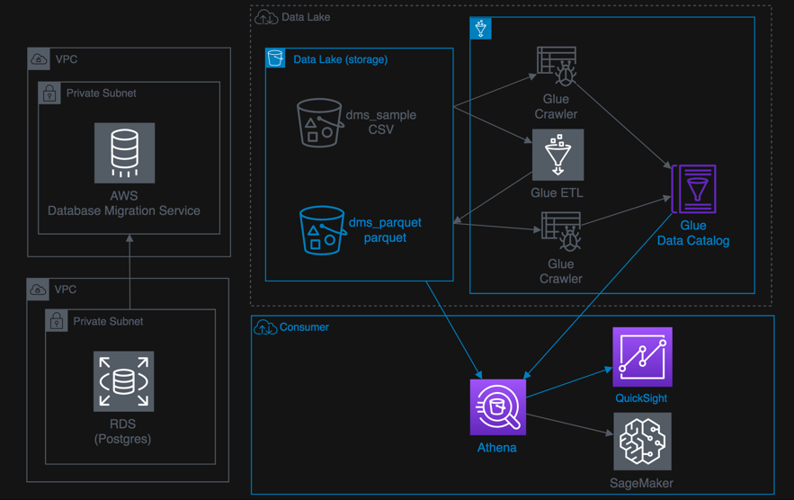

+++
title = "08 Lab: Athena and QuickSight"
weight = 800
+++

### Introduction

This lab introduces you to AWS Glue, Amazon Athena, and Amazon QuickSight. AWS Glue is a fully managed data catalog and ETL service; Amazon Athena queries data; and Amazon QuickSight provides visualization of the data you import.
 

**Below is a list of the steps for this lab:**

{}
